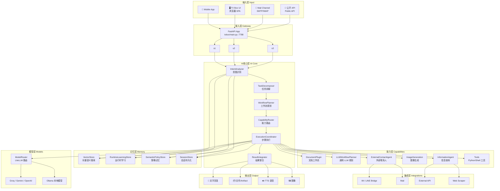
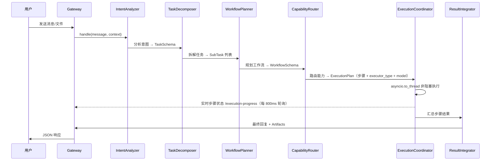
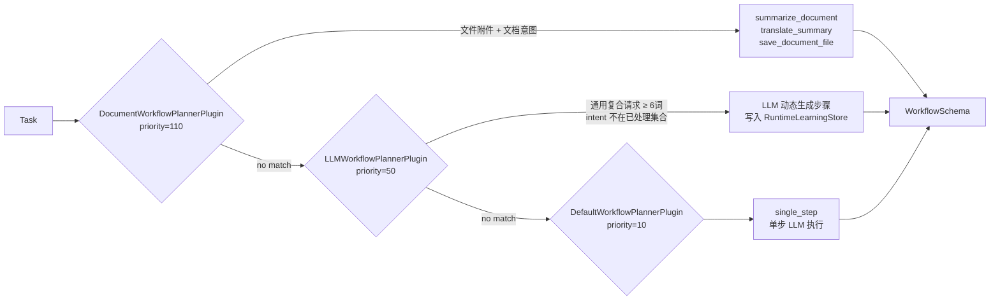
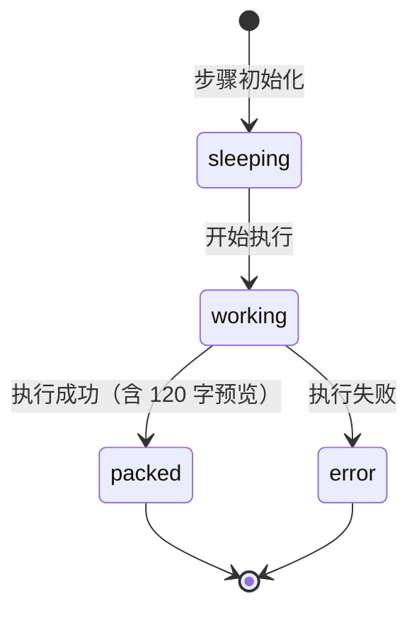
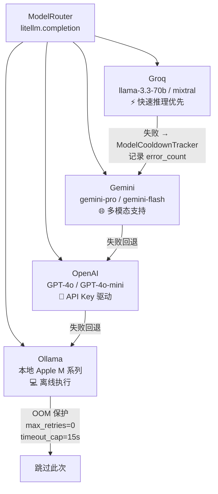
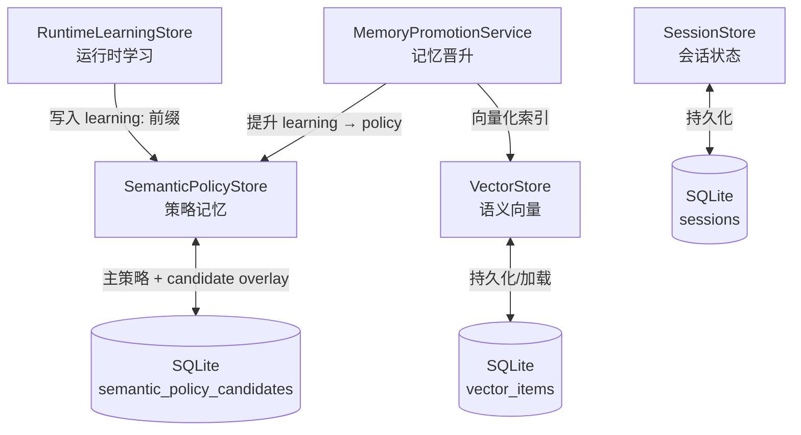
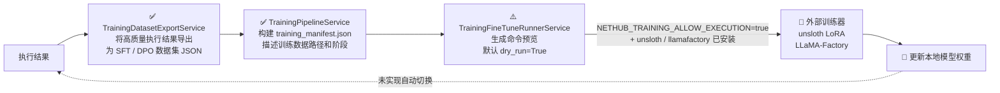
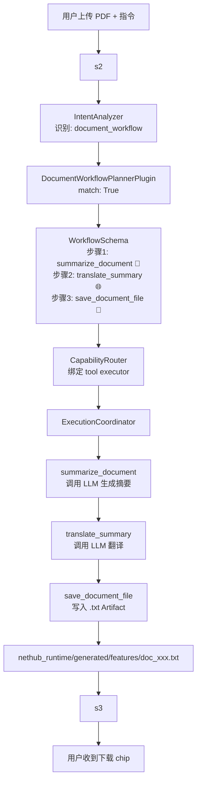

# NestHub 系统架构概览

> 更新日期：2026-04-23
> 
> 模块级说明与复用落位请同时参考：`docs/01_architecture/nethub_runtime_module_guide.md`

---

## 1. 系统简介

NestHub 是一个 AI 驱动的家庭中枢系统，能够接收多模态输入（文字、语音、文件、图片、邮件），通过内部 AI Core 进行意图理解、任务拆解、工作流编排，调用内部能力或外部服务完成任务，最终以文字、语音、文件等形式输出结果。

**主进程**：FastAPI + uvicorn，运行于 `127.0.0.1:7788`  
**入口**：`nethub_runtime/tvbox/main.py` → `_create_app()`  
**核心包**：`nethub_runtime/`

---

## 2. 顶层架构图



---

## 3. 各大模块说明

### 3.1 接入层（tvbox/main.py）

FastAPI 应用，负责 HTTP 路由、文件上传解析、静态资源服务、Session 管理。

| 路径 | 说明 |
| ------ | ------ |
| `GET /` | TV Box SPA 入口 |
| `POST /api/voice/chat` | 文字/语音指令，返回回复 + Artifacts |
| `POST /api/custom-agents/intake` | 文件附件 + 指令，触发复合工作流 |
| `GET /api/tvbox/execution-progress` | 实时轮询当前工作流步骤状态 |
| `GET /generated/*` | 静态 Artifact 文件（repo 根目录） |
| `GET /pkg-generated/*` | 静态 Artifact 文件（nethub_runtime 包内） |

---

### 3.2 AI 核心层（core/services/core_engine.py）

**技术栈**：Python 3.12 · FastAPI async · asyncio · LangGraph · LiteLLM · sentence-transformers

`AICore` 是系统的思考层、决策层和编排层，`handle()` 是唯一的公共入口。所有子服务在 `__init__` 中按依赖顺序初始化，均为已落地的实现。



#### 3.2.1 IntentAnalyzer（意图识别）

- **实现**：`SemanticIntentPlugin`（priority=100）+ 插件链
- **技术**：
  - `RuntimeKeywordSignalAnalyzer`：基于规则的关键词信号分析，从 `SemanticPolicyStore` 读取动态关键词词典
  - `VectorStore`：语义相似度匹配历史意图（sentence-transformers 或 token 降级）
  - `ObsidianMemoryStore`：可选 Obsidian Vault 作为 RAG 知识源，无配置则 no-op
  - `IntentPolicyManager`：从 `intent_policy.json` 加载标记词（query_markers / record_markers / agent_markers 等）
- **输出**：`TaskSchema`（含 intent / entities / session_state / context_tags）

#### 3.2.2 TaskDecomposer（任务拆解）

- **实现**：`task_decomposer.py` — 将 TaskSchema 映射为 `SubTask` 列表
- 根据 intent 类型决定是单步任务还是多步任务（如 `document_workflow` → 拆为 file_read + summarize + translate + save）

#### 3.2.3 WorkflowPlanner + Plugin Chain

`WorkflowPlanner` 使用**优先级插件链**（从 `plugin_config.json` 加载），按 priority 从高到低试 `match()`，第一个命中的插件执行 `run()` 返回 `WorkflowSchema`：



配置：`nethub_runtime/core/config/plugin_config.json`

#### 3.2.4 CapabilityRouter（能力路由）

- **实现**：`capability_router.py` — JSON 规则文件驱动（`model_routes.json` / `runtime_capabilities.json`，支持热重载）
- 每个步骤 → `_task_kind_from_step()` 确定任务类型 → 查 route config → `_executor_type_for_step()` 确定执行器类型：

| executor_type | 说明 | 示例步骤 |
| --------------- | ------ | --------- |
| `llm` | 调用 ModelRouter | `single_step`, `analyze_workflow_context` |
| `tool` | 调用注册工具/Handler | `summarize_document`, `save_document_file` |
| `agent` | 启动 Agent 子流程 | `manage_information_agent` |
| `knowledge_retrieval` | 查 VectorStore | `query_information_knowledge` |

未知步骤名（LLM 动态生成）默认为 `llm_execution`，不会丢弃。

#### 3.2.5 ExecutionCoordinator（执行协调器）

- **实现**：`execution_coordinator.py` — DAG 顺序执行，尊重 `depends_on` 字段
- **非阻塞**：在 `core_engine.py` 中通过 `asyncio.to_thread()` 包装，释放事件循环供轮询接口使用
- **实时进度**：模块级 `_session_step_progress: dict[str, list]`，用 `threading.Lock` 保护；步骤状态机：



- **上下文传递**：`_run_llm_step` 将所有前序步骤输出（截断到 400 字）注入 prompt，步骤间自然链接
- **修复循环**：`ExecutionRepairLoop` — 步骤失败时尝试 LLM 自修复，重试 N 次
- **Hook 机制**：`HookRegistry` 支持 pre/post step 拦截（`hook_registry.py`），在步骤执行前后触发注册的回调

---

### 3.3 模型路由层（models/model_router.py）

**技术栈**：LiteLLM · httpx · PyYAML · threading.Lock · Ollama HTTP API

`ModelRouter` 是所有 LLM 调用的统一入口，实现了多 Provider 路由、冷却回退和本地模型管理。



#### ModelCooldownTracker（指数退避冷却）

完整实现，无占位：

```text
失败次数  冷却时间
   1      60 秒
   2      300 秒（5 分钟）
   3      1500 秒（25 分钟）
  4+      3600 秒（1 小时）
```

- 线程安全（`threading.Lock`），键为 `model_id`
- 成功调用后 `reset(model_id)` 清除冷却计时
- `status()` 接口暴露全部模型的剩余冷却时间（可观测）

#### LocalModelManager（本地模型管理）

- 通过 Ollama HTTP API 管理本地模型的拉取、状态检查和切换
- `_running_under_pytest()` 检测测试环境（基于 env var + argv，不依赖 sys.modules），自动跳过外部调用

#### 配置文件

`nethub_runtime/config/model_config.yaml` — 定义 provider 列表、每个 provider 的 model_id、api_key env var、max_retries、timeout 等参数

---

### 3.4 记忆层（core/memory/）

**技术栈**：SQLite（WAL 模式）· sentence-transformers（`all-MiniLM-L6-v2`）· threading.Lock · JSON

记忆层由四个独立模块组成，相互协作构成完整的状态持久化和自我学习能力：



#### VectorStore（语义向量存储）

- **内存结构**：`dict[item_id, item]`，支持按 namespace 分组
- **持久化**：`SQLiteVectorPersistence`（WAL + NORMAL 同步模式），Schema：

  ```sql
  CREATE TABLE vector_items (
      item_id TEXT PRIMARY KEY, namespace TEXT, content TEXT,
      metadata TEXT, tokens TEXT, embedding TEXT, updated_at TEXT
  )
  ```

- **向量化策略**：
  - 优先：`sentence-transformers/all-MiniLM-L6-v2`（opt-in，需安装 `sentence_transformers`）
  - 降级：TF-IDF 风格 token 匹配（regex 分词，无需额外依赖）
- **相似度阈值**：`embedding_or_token` 模式，阈值 0.62（可通过 SemanticPolicyStore 覆盖）

#### SemanticPolicyStore（语义策略存储）

- **主策略**：从 `semantic_policy.json` 读取（read-only 静态配置）
- **Candidate Overlay**：SQLite 存储运行时收集的候选记录，每条记录有 `confidence`、`hit_count`、`status`（pending / accepted / rejected）
- **合并逻辑**：`load_runtime_policy()` = 主策略 + `_build_active_overlay()`（只合并 accepted candidates）
- **自动晋升**：`hit_count` 和 `confidence` 达到阈值后候选项自动升为 accepted
- **支持的策略键**：`location_markers`, `time_markers`, `entity_aliases.actor`, `record_type_rules`, `query_metric_rules` 等（共 15 类）

#### RuntimeLearningStore（运行时学习）

- **后端**：复用 `SemanticPolicyStore`，所有记录以 `"learning:"` 为键前缀存储
- **记录 Schema**：

  ```json
  {
    "task_type": "document_workflow",
    "gap": "no_document_handler",
    "strategy": "llm_planner",
    "outcome": "success",
    "detail": "3 steps executed",
    "attempt_count": 1,
    "timestamp": "2026-04-20T..."
  }
  ```

- **用途**：`LLMWorkflowPlannerPlugin` 成功规划后写入；未来相同意图可直接复用计划，跳过 LLM 调用

#### SessionStore + SessionCompactor（会话持久化）

- **存储**：内存 dict + `SQLiteSessionPersistence` 双层（冷启动时从 SQLite 恢复）
- **压缩策略**：`SessionCompactor` — 当 records 超过 `max_records=50` 时，将最旧的 N 条压缩为 1 条摘要，保留最新 `compact_to=5` 条；`summarize_fn` 可注入 LLM 摘要函数（默认 JSON dump 降级）
- 任务会话与主会话通过前缀 `"task:"` 区分

---

### 3.5 能力层（core/services/ 各插件和服务）

**技术栈**：litellm · httpx · diffusers · Pillow · BeautifulSoup · SMTP/IMAP · subprocess

能力层是 NestHub 实际"做事"的地方，每种能力都有独立的 Service 类，由 `ExecutionCoordinator` 按步骤类型调度。

#### DocumentWorkflowPlannerPlugin（priority=110）

文件：`document_runtime_plugin.py`

- **匹配条件**：附件中有 `.pdf/.doc/.docx/.xls/.xlsx/.csv/.txt/.md/.png/.jpg/.webp` 等文件，且 intent 为文档处理类
- **等待状态机**：支持「先说需求后上传文件」和「先上传后说需求」两种顺序，用 `SemanticPolicyStore` 持久化等待状态，超时 `120~300` 秒（`NESTHUB_DOCUMENT_WAIT_TIMEOUT_SECONDS` env 控制）
- **生成工作流**（已落地，非 TODO）：
  1. `summarize_document` — OCR/文本提取 + LLM 摘要
  2. `translate_summary` — LLM 翻译（若请求包含翻译指令）
  3. `save_document_file` — 写入 `nethub_runtime/generated/features/doc_xxx.txt`，挂载于 `/pkg-generated`
- **图片处理**：`extract_image_text_with_ocr()` — 支持 tesseract 或 LLM 视觉模型 OCR

#### LLMWorkflowPlannerPlugin（priority=50）

文件：`llm_workflow_planner_plugin.py`

- **匹配条件**：`intent not in _HANDLED_INTENTS` AND 请求字数 ≥ 6
- **LLM 规划**：`_llm_plan_workflow()` 调用 Groq → Gemini → OpenAI（按 API Key 可用性），prompt 要求返回 `[{"name": str, "goal": str, "label": str}]` JSON
- **回退**：LLM 失败 → 单步 `single_step`，保证执行不中断
- **步骤链接**：自动为每个步骤设置 `depends_on` 前一步骤，形成线性 DAG
- **知识写回**：成功计划通过 `RuntimeLearningStore.record_attempt()` 持久化

#### DefaultWorkflowPlannerPlugin（priority=10）

- 兜底插件，所有请求都能匹配
- 生成单步 `single_step` 工作流，由 `_run_llm_step` 处理

#### InformationAgentService（信息智能体）

文件：`information_agent_service.py`

- **功能**：管理结构化信息采集智能体（如「帮我建一个记录家庭开销的智能体」）
- **采集模式**：`guided_collection` — 通过多轮对话引导用户填写 schema_fields（`item_name / item_type / summary / details`）
- **状态持久化**：对话状态存在 `SessionStore`（键：agent_id），可跨 session 恢复
- **VectorStore 查询**：`query_agent_knowledge` 步骤使用向量相似度搜索已记录的信息条目
- **InformationProfileSignalAnalyzer**：从用户输入中提取字段值，使用 LLM + 规则混合

#### ImageGenerationService（图像生成）

文件：`image_generation_service.py`

- **后端优先级**（全部已实现）：
  1. `local_diffusion` — diffusers + torch（本地模型推理）
  2. `huggingface_auto` — 自动从 HuggingFace Hub 拉取小型模型（如 `nota-ai/bk-sdm-tiny`）
  3. `openai_api` — DALL-E via ModelRouter
  4. `pillow` — 几何绘图占位图（绝对兜底，无 GPU 无网络也能运行）
- **自愈能力**：后端缺失时调用 `CapabilityAcquisitionService` 自动 pip 安装所需包，重试整个后端链
- **结果校验**：`ImageGenerationVerifier` 验证生成图像的有效性
- **修复循环**：`ImageGenerationRepairLoop` — 生成失败时生成并执行最小 Python 代码到子进程

#### ExecutionRepairLoop & RuntimeRepairService

- `ExecutionRepairLoop`：步骤失败时让 LLM 分析错误，生成修复方案并重试
- `RuntimeRepairService`：系统级修复，可触发 Blueprint 重生成或能力重装
- `RuntimeFailureClassifier`：将失败类型分类（model_unavailable / tool_missing / logic_error 等），决定修复策略

---

### 3.7 集成层（integrations/）

| 子目录 | 说明 |
| -------- | ------ |
| `im/` | IM 消息（LINE Bridge 等） |
| `mail/` | SMTP/IMAP 邮件收发 |
| `external_api/` | 第三方 API 调用 |
| `web/` | 网页抓取/搜索 |
| `storage/` | 外部存储集成 |

---

### 3.8 训练流水线（core/services/training_*）

> ⚠️ **落地状态说明**：数据集收集和 Manifest 生成已完整实现；实际的模型微调（Fine-Tuning）和深度学习训练**未在 NestHub 内部实现**，属于后续作业。



#### 已实现部分

| 组件 | 文件 | 状态 | 说明 |
| ---- | ---- | ---- | ---- |
| `TrainingDatasetExportService` | `training_dataset_export_service.py` | ✅ 完整 | 每次执行后自动从 `final_output` 提取高质量结果，生成 SFT / Preference 样本 JSON |
| `TrainingPipelineService` | `training_pipeline_service.py` | ✅ 完整 | 扫描 artifact store 中的 dataset，构建含 stages/profile 的 `training_manifest.json` |
| `TrainingFineTuneRunnerService.inspect_runner()` | `training_fine_tune_runner_service.py` | ✅ 完整 | 生成命令预览 + manifest 检查，不触发真实训练 |
| `TrainingFineTuneRunnerService.start_run()` | `training_fine_tune_runner_service.py` | ⚠️ 脚手架 | 默认 `dry_run=True`；若 `NETHUB_TRAINING_ALLOW_EXECUTION=true` 且外部 backend 已安装，才通过 `subprocess.run` 调用外部训练器 |
| `nethub_runtime/training/run.py` | `training/run.py` | ✅ 完整 | CLI 入口，支持 `--inspect / --dry-run / --execute --backend=unsloth` |

#### 未实现部分（后续作业）

| 缺口 | 说明 |
| ---- | ---- |
| **实际模型微调** | NestHub 内部无梯度计算，依赖外部工具（`unsloth` / `llamafactory-cli`）安装后通过 subprocess 触发 |
| **训练完成后自动切换模型** | `_execute_if_requested` 执行完 subprocess 后不会自动更新 `model_config.yaml` 或切换 Ollama 模型 |
| **深度学习推理层** | 无自建 DL 推理，全部通过 LiteLLM → 云端 API 或 Ollama 本地进行 |
| **训练监控** | 无 loss 曲线、checkpoint 保存、EarlyStopping 等训练过程监控 |

---

## 4. 目录结构速查

```text
nesthub/
├── nethub_runtime/          # 核心运行时包
│   ├── tvbox/               # FastAPI 接入层 + 前端 SPA
│   │   ├── main.py          # 应用工厂 _create_app()
│   │   └── static/          # 前端 HTML/JS/CSS
│   ├── core/                # AI 核心
│   │   ├── services/        # 所有核心服务（意图/规划/路由/执行）
│   │   ├── memory/          # 记忆子系统
│   │   ├── config/          # plugin_config.json 等
│   │   ├── hooks/           # 步骤前后钩子
│   │   ├── tools/           # Python/Shell 工具注册
│   │   └── workflows/       # LangGraph 工作流执行器
│   ├── models/              # ModelRouter + Provider 适配层
│   ├── agents/              # Agent 基类 / Planner / Executor
│   ├── execution/           # Pipeline / Dispatcher / TaskRunner
│   ├── integrations/        # IM / Mail / Web / 外部 API
│   ├── training/            # 训练数据构建
│   ├── generated/           # 运行时生成的 Artifacts
│   └── config/              # model_config.yaml / bridge_external.yaml
├── api/                     # 公开 API（对外接口）
├── test/                    # 回归测试套件
├── scripts/                 # CI 脚本
└── docs/                    # 文档
    ├── 01_architecture/     # ← 本文档所在位置
    ├── 02_router/
    ├── 03_core/
    └── ...
```

---

## 5. 关键数据流：复合文档请求

以「文档总结 → 翻译 → 生成 txt 文件」为例：



---

*本文档由 GitHub Copilot 根据源码自动生成，如有出入以源码为准。*
