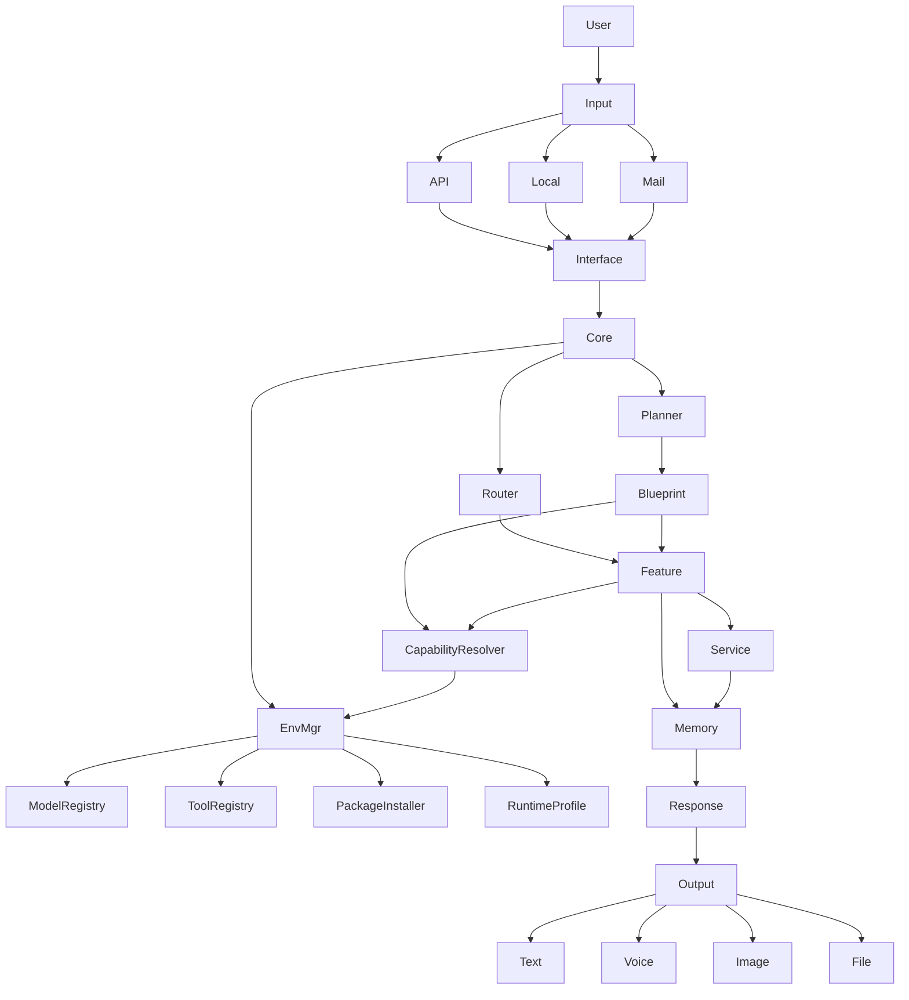

# NestHub Project Context

---

# 1. System Overview

HomeHub is an AI-driven orchestration system.

It converts multi-modal user input (voice, image, file, text, mail) into structured tasks, executes them through internal features or external services, and returns results in multiple formats.

Core pipeline:

User → Input Channel → API (optional) → Interface → AI Core → Environment Manager → Feature / Blueprint / Service → Memory → Response → Output

---

# 2. Architecture Diagram



---

# 3. Input Layer

### Channels

1. App (via API)
2. TV BOX (Local / LAN)
3. Mail (SMTP / IMAP)

### Key Rule

* API Layer = transport only
* No OCR / STT / parsing here

### TV BOX Extension

TV BOX is not just an input terminal.
It is also a managed local runtime node.

It may provide:

* local shell execution
* local script execution
* local model runtime
* local tool runtime
* LAN device control
* offline-first feature execution

---

# 4. Interface Layer (Normalization Layer)

Responsible for converting ALL inputs into:

👉 Core Text Document
👉 Unified Context

### Supported Input Types

* Voice → STT → Text
* Image → OCR → Text
* File → Parse → Text
* Mail → Extract → Text
* Text → Direct

---

# 5. AI Core (核心)

AI Core is the brain of the system.

### Responsibilities

1. Process Unified Context
2. Semantic understanding
3. Task decomposition
4. Routing & orchestration
5. Capability detection
6. Runtime requirement resolution

### Internal Modules

* Router → decide execution path
* Planner → split tasks
* Context Manager → manage state
* Capability Resolver → resolve required model/tool/package
* Environment Manager → prepare runtime before execution

---

# 6. Blueprint

Blueprint = execution logic (NOT fixed framework)

### Characteristics

* Can be predefined
* Can be generated by AI
* Can be dynamically created
* Can become reusable Feature
* Can declare runtime dependencies
* Can trigger automatic dependency installation

⚠ Not limited to LangChain / LangGraph

### Blueprint Metadata

Each Blueprint may include:

* required_models
* required_tools
* required_packages
* required_permissions
* supported_runtime
* install_policy

Example:

```yaml
blueprint:
  name: web_research
  runtime: python
  required_models:
    - qwen3:8b
  required_tools:
    - playwright
    - curl
  required_packages:
    - beautifulsoup4
    - lxml
  install_policy: auto_if_missing
```

---

# 7. Feature Layer

Executable capabilities

### Examples

* OCR
* Schedule
* File system
* External integrations
* Shell
* Python execution
* Browser automation
* Model inference

### Types

* Built-in Feature
* Generated Feature
* Agent-based Feature

### Feature Rule

Before execution, a Feature can request the runtime to verify:

* model availability
* tool availability
* package availability
* permission availability

If missing and allowed by policy, the system installs them automatically.

---

# 8. Service Layer

External capabilities

### Examples

* Web API
* Weather API
* Mail
* Speech services
* Package registry
* Model registry
* Tool download source

---

# 9. Environment Manager

Environment Manager is the bootstrap and runtime preparation layer.

### Responsibilities

1. Detect OS / architecture / shell capability
2. Build runtime profile for the current node
3. Install required packages
4. Pull required models
5. Install required tools
6. Cache reusable dependencies
7. Expose installed capabilities to Core

### Submodules

* Runtime Profile Detector
* Requirement Parser
* Model Manager
* Tool Manager
* Package Installer
* Permission Manager
* Cache Manager

### Runtime Profile Example

```json
{
  "node_type": "tv_box",
  "os": "android_tv",
  "arch": "arm64",
  "shell_supported": true,
  "python_supported": true,
  "ollama_supported": false,
  "docker_supported": false
}
```

---

# 10. Startup Bootstrap

On first startup, the node performs bootstrap.

### Bootstrap Flow

1. detect OS / CPU / shell capability
2. load runtime profile
3. parse requirements / manifest
4. install base packages
5. download required models
6. download required execution tools
7. verify environment
8. register available capabilities
9. start normal service

### Bootstrap Sources

The bootstrap may read from:

* requirements.txt
* pyproject.toml
* blueprint manifest
* feature manifest
* model manifest
* tool manifest
* device profile

---

# 11. Requirements Strategy

Requirements are not limited to Python packages.

The system should support a unified dependency format.

### Dependency Types

* python packages
* shell tools
* browser tools
* model files
* runtime binaries
* OS permissions

### Recommended Unified Manifest

```yaml
dependencies:
  packages:
    - requests
    - pyyaml
  tools:
    - name: playwright
      install: "pip install playwright && playwright install chromium"
    - name: ffmpeg
      install: "apt-get install -y ffmpeg"
  models:
    - provider: ollama
      name: qwen3:8b
    - provider: huggingface
      name: faster-whisper-small
```

---

# 12. Model Strategy

System uses multi-model routing.

## 12.1 Local Models (Ollama)

Used for:

* Fast routing
* Local reasoning
* Privacy tasks

Examples:

* Qwen3
* Qwen2.5
* Gemma
* Llama

## 12.2 Coding / Blueprint Models

* Qwen3-Coder
* GPT-5.4
* Claude Sonnet

## 12.3 External Models

### OpenAI

* GPT-5.4 → strongest reasoning
* GPT-4.1 → long context
* mini/nano → cheap tasks

### Claude

* Sonnet 4.6 → stable production
* Claude 4 → complex reasoning

### Gemini

* 2.5 Pro → deep reasoning
* 2.5 Flash → fast
* Flash-Lite → low cost

## 12.4 Task Mapping

| Task        | Model        |
| ----------- | ------------ |
| Routing     | Local        |
| Planning    | GPT / Claude |
| Blueprint   | Coder Model  |
| Document    | GPT / Claude |
| Web Summary | GPT / Gemini |

## 12.5 Model Auto-Pull Rule

When a Blueprint or Feature requires a model:

1. check local registry
2. if model exists, use directly
3. if missing and install policy allows, pull automatically
4. verify checksum / version
5. register to local model registry
6. continue execution

---

# 13. Tool Auto-Install Rule

When execution requires a missing tool:

1. detect required tool
2. match installation method by OS/runtime
3. install automatically if policy allows
4. verify executable path
5. cache and register tool
6. continue execution

Examples:

* Playwright missing → install Python package + browser runtime
* ffmpeg missing → install system package
* adb missing → install Android toolchain helper
* jq missing → install shell utility

---

# 14. TV BOX Execution Policy

TV BOX should support controlled shell execution.

### Allowed Scopes

* approved local scripts
* approved feature commands
* environment inspection
* tool installation
* model download
* local automation

### Restrictions

* sandbox by default
* whitelist commands
* resource limits
* timeout control
* permission boundary
* execution logging

### Rule

Shell is a capability, not a default free-for-all terminal.

---

# 15. Web Retrieval Pipeline

NOT simple fetch.

### Pipeline

1. Query plan
2. Fetch (Playwright / HTTP)
3. Render (if needed)
4. Extract
5. Filter
6. Select key info
7. Build evidence
8. Summarize

## Retrieval Tech

* Playwright → dynamic pages
* HTTP → static pages

---

# 16. Filtering Strategy

After fetching:

* remove ads
* remove navigation
* extract key data
* structure content

---

# 17. Default Assumptions

Unless specified:

* API = transport only
* Blueprint ≠ LangChain default
* Memory ≠ vector DB default
* App may use public API
* TV BOX = local runtime node
* Mail = independent channel
* missing models may be auto-pulled
* missing tools may be auto-installed
* runtime dependencies may be resolved on demand

---

# 18. AI Constraints

DO NOT assume:

* single model system
* fixed feature system
* direct HTML usage
* static blueprint
* preinstalled environment only

---

# 19. Mental Model

| Layer               | Role                         |
| ------------------- | ---------------------------- |
| API                 | transport                    |
| Interface           | normalize                    |
| Core                | think                        |
| Blueprint           | logic                        |
| Feature             | execute                      |
| Environment Manager | prepare runtime              |
| Memory              | store                        |

