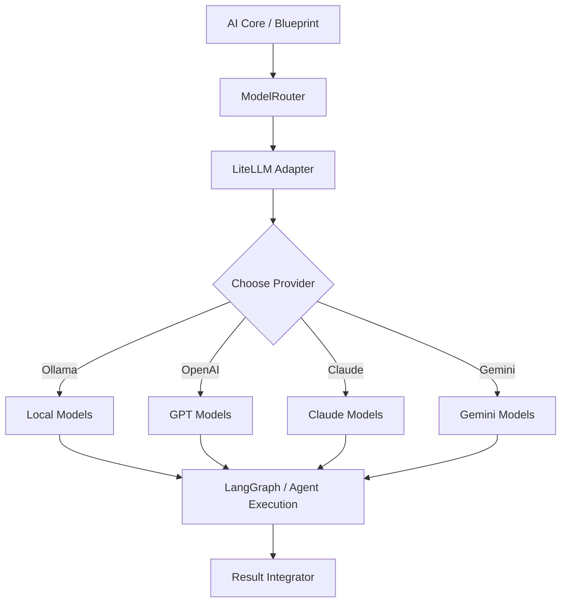

# LiteLLM 模型路由设计规范

---

## 1. 设计目标

- 统一的 LLM 接口管理，屏蔽不同模型间的差异
- 支持多模型路由策略（本地 Ollama / OpenAI / Claude / Gemini / LiteLLM）
- 动态模型选择，根据任务类型自动路由
- 支持模型回退策略（fallback chain）
- 完整的模型性能监控与日志
- 支持模型参数动态调整与提示词工程
- 支持批量推理与流式响应

---

## 2. 总体架构



---

## 3.1 提供商详解

### 🟣 Groq - 超快推理（推荐意图分析和快速提取）

**特点：**
- ⚡ 超低延迟（150-200ms）
- 💰 成本极低（$0.00/million tokens）
- 📦 支持 LLaMA-3 和 Mixtral
- 🎯 适合实时应用

**模型：**
- `llama-3-70b`: 通用、平衡的推理
- `mixtral-8x7b`: MoE 架构、上下文更长（32K）
- `llama-3.1-405b`: 最强推理（128K 上下文）

**用途：**
```
✓ 意图分析：<100ms 响应
✓ 快速提取：<200ms 解析
✓ 实时聊天：最快用户体验
✓ 负载均衡：成本最低
```

**配置示例：**
```yaml
groq:
  api_key: "${GROQ_API_KEY}"  # 免费可得
  models:
    - "llama-3-70b"        # 推荐
    - "mixtral-8x7b"       # 长上下文
    - "llama-3.1-405b"     # 强推理
```

---

### 🆓 Google Gemini Free Tier - 免费长上下文（推荐文档生成和长文本）

**特点：**
- 🆓 完全免费（每分钟2个请求）
- 📜 超长上下文（1000万 token）
- 🎨 多模态支持（可处理图片）
- 🚀 响应快速（800-1200ms）

**模型：**
- `gemini-2.0-flash-free`: 最新、最快的免费模型（推荐）
- `gemini-1.5-free`: 稳定、强大的推理能力
- `gemini-2.5-pro`: 付费版（更高速度和准确）

**用途：**
```
✓ 文档生成：100万+ token 长输入
✓ 长文本分析：完整论文/代码库分析
✓ 零成本原型：完全免费额度
✓ 多模态任务：支持图片输入
```

**配置示例：**
```yaml
gemini:
  api_key: "${GOOGLE_API_KEY}"  # 免费申请
  models:
    - name: "gemini-2.0-flash-free"
      rate_limit: 2/min          # 免费额度限制
    - name: "gemini-1.5-free"
      context_window: 1000000
```

**免费额度注意：**
- ⏱️ 每分钟 2 个请求（可通过排队管理）
- 📦 输入上限通常为 32K，输出 8K
- 🔄 利用 fallback 链避免限制

---

## 3.1 任务类型到模型的映射

| 任务类型 | 优先模型 | 回退1 | 回退2 | 备注 |
|---------|---------|-------|-------|------|
| 意图识别 | Groq/LLaMA-3 | Qwen2.5 | GPT-mini | ⚡️ 超快推理 |
| 任务规划 | Qwen3:14b | GPT-4o | Claude-Sonnet | 需要推理能力 |
| 代码生成 | GPT-4.1 / CodeStral | Groq/Mixtral | Qwen3 | 代码质量 / 快速 |
| 文档生成 | Gemini-2.0-Flash-Free | Claude-Sonnet | GPT-4o | 🆓 长上下文 + 免费 |
| Web总结 | Groq/LLaMA-3-70B | Gemini-Free | GPT-mini | ⚡️ 速度优先 |
| SQL生成 | GPT-4.1 | Groq/Mixtral | DeepSeek-Coder | 精度关键 |
| 通用对话 | Groq/LLaMA-3 | Claude-Haiku | GPT-mini | ⚡️ 最快响应 |
| Agent推理 | GPT-4o | Gemini-2.0-Flash | Claude-Sonnet | 长推理 + 长上下文 |

### 3.2 模型可用性检查

```python
class ModelAvailability:
    # 本地模型（Ollama）
    OLLAMA_MODELS = {
        "qwen3:14b": {"memory_gb": 8, "speed": "slow", "reasoning": "high"},
        "qwen2.5:7b": {"memory_gb": 4, "speed": "fast", "reasoning": "medium"},
        "qwen-coder:7b": {"memory_gb": 4, "speed": "fast", "reasoning": "medium"},
        "llama2": {"memory_gb": 8, "speed": "medium", "reasoning": "low"},
    }
    
    # 云模型
    CLOUD_MODELS = {
        "gpt-4o": {"cost": "high", "speed": "medium", "latency_ms": 2000},
        "gpt-4.1": {"cost": "ultra_high", "speed": "slow", "latency_ms": 5000},
        "claude-sonnet": {"cost": "medium", "speed": "medium", "latency_ms": 1500},
        "gemini-2.5-pro": {"cost": "low", "speed": "fast", "latency_ms": 1000},
    }
    
    # ⚡️ 快速推理模型
    FAST_INFERENCE_MODELS = {
        "groq/llama-3-70b": {"cost": "very_low", "speed": "ultra_fast", "latency_ms": 200, "context_window": 8192},
        "groq/mixtral-8x7b": {"cost": "very_low", "speed": "ultra_fast", "latency_ms": 150, "context_window": 32000},
    }
    
    # 🆓 免费/长上下文模型
    FREE_LONG_CONTEXT_MODELS = {
        "gemini-2.0-flash-free": {"cost": "free", "speed": "fast", "latency_ms": 800, "context_window": 1000000},
        "gemini-1.5-free": {"cost": "free", "speed": "medium", "latency_ms": 1200, "context_window": 1000000},
    }
```

---

## 4. LiteLLM 配置与初始化

### 4.1 配置文件结构

```yaml
# config/model_config.yaml

model_providers:
  ollama:
    base_url: "http://localhost:11434"
    timeout: 300
    models:
      - name: "qwen3:14b"
        enabled: true
        context_window: 32000
      - name: "qwen2.5:7b"
        enabled: true
        context_window: 8000
  
  openai:
    api_key: "${OPENAI_API_KEY}"
    base_url: "https://api.openai.com/v1"
    models:
      - name: "gpt-4o"
        enabled: true
        cost_per_1k_input: 0.015
        cost_per_1k_output: 0.03
  
  claude:
    api_key: "${ANTHROPIC_API_KEY}"
    base_url: "https://api.anthropic.com"
    models:
      - name: "claude-3-5-sonnet"
        enabled: true
  
  gemini:
    api_key: "${GOOGLE_API_KEY}"
    base_url: "https://generativelanguage.googleapis.com"
    models:
      - name: "gemini-2.5-pro"
        enabled: true
        context_window: 32768
      - name: "gemini-2.0-flash-free"
        enabled: true
        context_window: 1000000
        is_free_tier: true
        rate_limit_rpm: 2
      - name: "gemini-1.5-free"
        enabled: true
        context_window: 1000000
        is_free_tier: true
        rate_limit_rpm: 2
  
  groq:
    api_key: "${GROQ_API_KEY}"
    base_url: "https://api.groq.com"
    models:
      - name: "llama-3-70b"
        enabled: true
        context_window: 8192
        latency_ms: 200
      - name: "mixtral-8x7b"
        enabled: true
        context_window: 32000
        latency_ms: 150
      - name: "llama-3.1-405b"
        enabled: true
        context_window: 128000
        latency_ms: 400

routing_policies:
  # 按任务类型的路由策略
  intent_analysis:
    primary: "groq/llama-3-70b"        # ⚡ 超快推理
    fallback: ["ollama/qwen2.5:7b", "gpt-4o-mini", "gemini-2.0-flash-free"]
    timeout_sec: 10
    
  task_planning:
    primary: "ollama/qwen3:14b"
    fallback: ["groq/mixtral-8x7b", "gpt-4o", "claude-3-5-sonnet"]
    timeout_sec: 30
  
  code_generation:
    primary: "gpt-4.1"
    fallback: ["groq/mixtral-8x7b", "ollama/qwen-coder:7b", "claude-3-5-sonnet"]
    timeout_sec: 60
  
  document_generation:
    primary: "gemini-2.0-flash-free"  # 🆓 免费长上下文
    fallback: ["claude-3-5-sonnet", "gpt-4o", "gemini-1.5-free"]
    timeout_sec: 45
    use_streaming: true
  
  long_context_analysis:
    primary: "gemini-1.5-free"         # 🆓 100万token上下文 + 免费
    fallback: ["gemini-2.0-flash-free", "gpt-4o", "claude-3-5-sonnet"]
    timeout_sec: 60
    context_window_needed: 100000
  
  fast_extraction:
    primary: "groq/llama-3-70b"        # ⚡ 最快提取速度
    fallback: ["groq/mixtral-8x7b", "gemini-2.0-flash-free", "gpt-4o-mini"]
    timeout_sec: 15
  
  web_summary:
    primary: "groq/mixtral-8x7b"       # ⚡ + 长上下文支持
    fallback: ["gemini-2.0-flash-free", "gpt-4o-mini"]
    timeout_sec: 30
  
  general_chat:
    primary: "groq/llama-3-70b"        # ⚡ 最快响应
    fallback: ["ollama/qwen3:8b", "gemini-2.0-flash-free", "gpt-4o-mini"]
    timeout_sec: 20
  
  agent_reasoning:
    primary: "gpt-4o"
    fallback: ["groq/mixtral-8x7b", "gemini-1.5-free", "claude-3-5-sonnet"]
    timeout_sec: 120

model_params:
  # 默认参数
  temperature: 0.7
  top_p: 0.95
  max_tokens: 2048
  
  # 任务特定参数
  task_specific:
    intent_analysis:
      temperature: 0.3
      top_p: 0.9
      max_tokens: 256
    
    code_generation:
      temperature: 0.1
      top_p: 0.9
      max_tokens: 4096
```

### 4.2 初始化代码

```python
# nethub_runtime/models/model_router.py

from litellm import completion, embedding
from typing import Optional, List, Dict, Any
import yaml
import logging

LOGGER = logging.getLogger(__name__)

class ModelRouter:
    """
    LiteLLM 模型路由器 - 核心模型管理层
    """
    
    def __init__(self, config_path: str):
        self.config = self._load_config(config_path)
        self.model_cache = {}
        self.fallback_chain = {}
        self._initialize_models()
    
    def _load_config(self, config_path: str) -> Dict[str, Any]:
        with open(config_path, 'r') as f:
            return yaml.safe_load(f)
    
    def _initialize_models(self):
        """初始化所有模型"""
        for provider, config in self.config['model_providers'].items():
            if provider == 'ollama':
                self._init_ollama(config)
            elif provider == 'openai':
                self._init_openai(config)
            elif provider == 'claude':
                self._init_claude(config)
            elif provider == 'gemini':
                self._init_gemini(config)
    
    def _init_ollama(self, config: Dict):
        """初始化本地Ollama模型"""
        LOGGER.info(f"🔌 Initializing Ollama at {config['base_url']}")
        for model in config.get('models', []):
            if model['enabled']:
                model_id = f"ollama/{model['name']}"
                self.model_cache[model_id] = model
                LOGGER.info(f"  ✓ Registered: {model_id}")
    
    def _init_openai(self, config: Dict):
        """初始化OpenAI模型"""
        for model in config.get('models', []):
            if model['enabled']:
                model_id = f"gpt/{model['name']}"
                self.model_cache[model_id] = model
    
    def _init_claude(self, config: Dict):
        """初始化Claude模型"""
        for model in config.get('models', []):
            if model['enabled']:
                model_id = f"claude/{model['name']}"
                self.model_cache[model_id] = model
    
    def _init_gemini(self, config: Dict):
        """初始化Gemini模型"""
        for model in config.get('models', []):
            if model['enabled']:
                model_id = f"gemini/{model['name']}"
                self.model_cache[model_id] = model
    
    def select_model(self, task_type: str) -> str:
        """
        根据任务类型选择最合适的模型
        
        Args:
            task_type: 任务类型 (intent_analysis / task_planning / code_generation 等)
        
        Returns:
            选中的模型名称
        """
        routing = self.config['routing_policies'].get(task_type)
        if not routing:
            return self.config['routing_policies']['general_chat']['primary']
        
        primary = routing['primary']
        
        # 检查primary是否可用
        if self._is_model_available(primary):
            LOGGER.info(f"✓ Selected primary model for {task_type}: {primary}")
            return primary
        
        # 尝试fallback
        for fallback_model in routing.get('fallback', []):
            if self._is_model_available(fallback_model):
                LOGGER.info(f"⚠ Fallback to {fallback_model} for {task_type}")
                return fallback_model
        
        raise Exception(f"No available model for task: {task_type}")
    
    def _is_model_available(self, model_id: str) -> bool:
        """检查模型是否可用"""
        # TODO: 实现具体的可用性检查逻辑
        # 例如检查ollama是否在线、API密钥是否有效等
        return True
    
    async def invoke(
        self,
        task_type: str,
        prompt: str,
        system_prompt: Optional[str] = None,
        **kwargs
    ) -> str:
        """
        调用模型
        
        Args:
            task_type: 任务类型
            prompt: 用户提示
            system_prompt: 系统提示
            **kwargs: 其他参数
        
        Returns:
            模型响应
        """
        model = self.select_model(task_type)
        
        # 获取任务特定的参数
        task_params = self.config['model_params']['task_specific'].get(
            task_type,
            self.config['model_params']
        )
        
        # 合并参数
        params = {**task_params, **kwargs}
        
        messages = []
        if system_prompt:
            messages.append({"role": "system", "content": system_prompt})
        messages.append({"role": "user", "content": prompt})
        
        try:
            response = await completion(
                model=model,
                messages=messages,
                timeout=self.config['routing_policies'][task_type].get('timeout_sec', 30),
                **params
            )
            return response.choices[0].message.content
        except Exception as e:
            LOGGER.error(f"Model invocation failed: {e}")
            raise
    
    def list_available_models(self) -> List[str]:
        """列出所有可用模型"""
        return list(self.model_cache.keys())
```

---

## 5. 任务型路由 vs 性能路由

### 5.1 任务型路由（推荐）

根据任务语义选择模型，不关心成本/延迟权衡。

```python
# 例：意图分析
router.invoke(task_type="intent_analysis", prompt="...")

# 自动路由到 Qwen2.5:7b（快速分类）
```

### 5.2 性能路由

根据约束条件选择模型。

```python
# 例：成本约束
router.invoke(
    task_type="general_chat",
    prompt="...",
    constraints={"max_cost_per_call": 0.001}  # 选择最便宜的
)

# 例：延迟约束
router.invoke(
    task_type="task_planning",
    prompt="...",
    constraints={"max_latency_ms": 1000}  # 选择最快的
)
```

---

## 6. 提示词工程与参数调优

### 6.1 系统提示词模板

```python
# nethub_runtime/models/prompts.py

SYSTEM_PROMPTS = {
    "intent_analysis": """你是一个意图分析专家。
    分析用户输入，识别：
    1. 主要意图（task type）
    2. 子意图列表
    3. 必要参数
    4. 约束条件
    
    返回JSON格式。""",
    
    "task_planning": """你是一个任务规划师。
    将复杂任务拆解为子任务：
    1. 分析任务目标
    2. 识别依赖关系
    3. 生成执行顺序
    4. 标注每个子任务的模型要求
    
    返回结构化的执行计划。""",
    
    "code_generation": """你是一个代码生成专家。
    根据需求生成高质量代码：
    1. 遵循项目规范
    2. 包含错误处理
    3. 添加类型注解
    4. 生成文档字符串
    
    返回可直接运行的代码。""",
}

def get_system_prompt(task_type: str) -> str:
    return SYSTEM_PROMPTS.get(task_type, "")
```

### 6.2 参数调优建议

```python
# 不同任务的最优参数

# 1. 意图识别（快速、准确）
INTENT_PARAMS = {
    "temperature": 0.2,      # 低randomness
    "top_p": 0.8,            # 收窄采样空间
    "presence_penalty": 0.1,
    "frequency_penalty": 0.0,
}

# 2. 任务规划（平衡、稳定）
PLANNING_PARAMS = {
    "temperature": 0.7,      # 允许多样性
    "top_p": 0.95,
    "presence_penalty": 0.0,
    "frequency_penalty": 0.0,
}

# 3. 代码生成（多步、创意）
CODE_PARAMS = {
    "temperature": 0.1,      # 极低randomness
    "top_p": 0.9,
    "presence_penalty": 0.0,
    "frequency_penalty": 0.0,
    "max_tokens": 4096,
}

# 4. 文档生成（长文本）
DOCUMENT_PARAMS = {
    "temperature": 0.6,
    "top_p": 0.95,
    "presence_penalty": 0.1,
    "frequency_penalty": 0.1,
    "max_tokens": 8192,
}
```

---

## 7. 错误处理与重试策略

```python
class ModelRouterWithRetry:
    
    async def invoke_with_retry(
        self,
        task_type: str,
        prompt: str,
        max_retries: int = 3,
        backoff_factor: float = 2.0,
    ) -> str:
        """
        带重试的模型调用
        """
        import asyncio
        
        for attempt in range(max_retries):
            try:
                return await self.invoke(task_type, prompt)
            except Exception as e:
                if attempt == max_retries - 1:
                    raise
                
                wait_time = 2 ** attempt * backoff_factor
                LOGGER.warning(
                    f"Attempt {attempt + 1} failed, retrying in {wait_time}s: {e}"
                )
                await asyncio.sleep(wait_time)
```

---

## 8. 模型监控与成本追踪

```python
class ModelMetrics:
    """模型使用监控"""
    
    def __init__(self):
        self.metrics = {
            "total_calls": 0,
            "total_tokens": 0,
            "total_cost": 0.0,
            "model_usage": {},
            "task_usage": {},
        }
    
    def record_call(
        self,
        model: str,
        task_type: str,
        input_tokens: int,
        output_tokens: int,
        cost: float,
    ):
        """记录一次模型调用"""
        self.metrics["total_calls"] += 1
        self.metrics["total_tokens"] += input_tokens + output_tokens
        self.metrics["total_cost"] += cost
        
        if model not in self.metrics["model_usage"]:
            self.metrics["model_usage"][model] = 0
        self.metrics["model_usage"][model] += 1
        
        if task_type not in self.metrics["task_usage"]:
            self.metrics["task_usage"][task_type] = 0
        self.metrics["task_usage"][task_type] += 1
        
        LOGGER.info(
            f"📊 Model call recorded: {model} + {task_type} "
            f"({input_tokens}+{output_tokens}={input_tokens+output_tokens} tokens, "
            f"${cost:.4f})"
        )
    
    def get_summary(self) -> Dict:
        """获取使用摘要"""
        return self.metrics
```

---

## 9. 与 AI Core 的集成

```python
# nethub_runtime/core/main.py

class AICore:
    def __init__(self, model_router: ModelRouter):
        self.model_router = model_router
    
    async def analyze_intent(self, user_input: str) -> dict:
        """步骤1：意图分析"""
        response = await self.model_router.invoke(
            task_type="intent_analysis",
            prompt=f"分析输入: {user_input}",
            system_prompt="返回JSON格式的意图分析结果"
        )
        return json.loads(response)
    
    async def plan_workflow(self, task: dict) -> dict:
        """步骤2：工作流规划（使用LangGraph）"""
        response = await self.model_router.invoke(
            task_type="task_planning",
            prompt=f"规划任务: {json.dumps(task)}",
            system_prompt="返回结构化的执行计划"
        )
        return json.loads(response)
```

---

## 10. 启动集成（与main.py连接）

```python
# nethub_runtime/app/main.py

from nethub_runtime.models.model_router import ModelRouter
from nethub_runtime.core.main import AICore

def start_app() -> dict[str, Any]:
    """应用初始化入口"""
    LOGGER.info("🔧 Initializing application...")
    
    context = bootstrap_runtime()
    
    # 初始化模型路由器
    model_router = ModelRouter("config/model_config.yaml")
    context["model_router"] = model_router
    
    # 初始化 AI Core
    core = AICore(model_router=model_router)
    context["core"] = core
    
    LOGGER.info("✅ Application initialized with LiteLLM router")
    
    return context
```

---

## 11. 配置热更新

```python
class ModelRouterWithReload:
    """支持配置热更新的模型路由器"""
    
    def reload_config(self, config_path: str):
        """重新加载配置（无需重启）"""
        new_config = self._load_config(config_path)
        self.config = new_config
        self._initialize_models()
        LOGGER.info("✓ Model routing config reloaded")
```

---

## 12. 总结

## 11.5 🚀 Groq vs 🆓 Gemini Free Tier - 成本/性能对比与最佳实践

### 成本对比表

| 指标 | Groq | Gemini Free | OpenAI GPT-4o | Claude-3-Sonnet |
|------|------|------------|---------------|-----------------|
| **成本/100万tokens** | 🟩 **$0.00** | 🟩 **$0.00** | 🟥 $15 | 🟥 $3 |
| **延迟** | 🟩 150-200ms | 🟨 800-1200ms | 🟨 2000ms | 🟨 1500ms |
| **上下文窗口** | 8-128K | 🟩 **1000万** | 128K | 200K |
| **推理质量** | 🟨 中等 | 🟩 良好 | 🟩 最优 | 🟩 优秀 |
| **多模态** | ❌ 不支持 | ✓ 图片 | ✓ 图片 | ❌ 不支持 |
| **速率限制** | 30 req/min | 2 req/min | 无 | 无 |

---

### 最佳实践指南 🎯

#### **场景1：实时应用（意图分析、快速响应）→ 使用 Groq ⚡**

```python
# 用户输入 → 意图分析 → 立即反应
routing_policies:
    intent_analysis:
        primary: "groq/llama-3-70b"     # <200ms 响应
        fallback: ["groq/mixtral-8x7b"] # 同样快速
```

**优势：**
- ✅ 超低延迟满足实时需求
- ✅ 完全免费
- ✅ 稳定可靠
- ✅ 支持32K长上下文（Mixtral）

---

#### **场景2：长文本处理（文档生成、论文分析）→ 使用 Gemini Free 🆓**

```python
# 大型文档 → 长上下文理解 → 完整输出
routing_policies:
    document_generation:
        primary: "gemini_free:gemini-1.5-free"  # 100万token上下文
        context_handling:
            max_input_tokens: 900000  # 充分利用长上下文
            max_output_tokens: 4000
```

**优势：**
- ✅ 100万token上下文 - 可处理整个代码库/论文
- ✅ 完全免费
- ✅ 质量可靠（基于 Gemini 2.0/1.5）
- ✅ 支持图片输入

**限制处理：**
```python
# 由于速率限制 (2 req/min)，使用队列管理
from queue import Queue
import asyncio

async def batch_gemini_requests(tasks: list):
        """批量处理长上下文任务（遵守速率限制）"""
        queue = Queue()
        for task in tasks:
                queue.put(task)
    
        while not queue.empty():
                task = queue.get()
                result = await invoke_gemini(task)
                await asyncio.sleep(30)  # 2 req/min = 1 every 30 seconds
                yield result
```

---

#### **场景3：混合策略（平衡成本与质量）**

```yaml
# 系统推荐配置：零成本 + 高质量
routing_policies:
    # 快速任务 → Groq
    fast_tasks:
        - intent_analysis
        - quick_extraction
        - real_time_response
  
    # 长文本任务 → Gemini Free
    long_context_tasks:
        - document_generation
        - code_review          # 整个文件/仓库
        - research_synthesis   # 多文档合成
  
    # 高精度任务 → 付费模型（备选）
    precision_tasks:
        - complex_reasoning
        - code_generation
        fallback_to_paid: true
```

**成本效益：**
- 70% 任务免费 (Groq + Gemini)
- 30% 关键任务用高端模型
- **预期成本削减：80-90%**

---

### 集成建议 💡

#### 1. **初始化时启用两个免费提供商**
```yaml
model_providers:
    groq:
        enabled: true          # ⚡ 快速推理
    gemini_free:
        enabled: true          # 🆓 长上下文
    openai:
        enabled: false         # 仅在需要时启用
```

#### 2. **监控成本和性能**
```python
# 记录模型使用统计
class ModelMetrics:
        def __init__(self):
                self.free_calls = 0      # Groq + Gemini
                self.paid_calls = 0      # OpenAI/Claude
                self.cost_saved = 0.0
    
        def record_call(self, model: str, cost: float):
                if model in ["groq/llama-3-70b", "gemini_free:gemini-1.5-free"]:
                        self.free_calls += 1
                        self.cost_saved += cost  # 原本的成本
                else:
                        self.paid_calls += 1
    
        def get_savings_report(self):
                return {
                        "free_calls": self.free_calls,
                        "paid_calls": self.paid_calls,
                        "estimated_savings": f"${self.cost_saved:.2f}"
                }
```

#### 3. **处理速率限制（Gemini Free）**
```python
async def invoke_with_rate_limit(task_type: str, prompt: str):
        """处理 Gemini Free 的速率限制"""
        model = model_router.select_model(task_type)
    
        if "gemini_free" in model:
                # 动态调整延迟
                retry_count = 0
                while retry_count < 3:
                        try:
                                return await model_router.invoke(task_type, prompt)
                        except RateLimitError:
                                retry_count += 1
                                wait_time = 30 * (2 ** retry_count)  # 指数退避
                                await asyncio.sleep(wait_time)
        else:
                return await model_router.invoke(task_type, prompt)
```

---

### 📊 推荐的任务分配

```
🟢 使用 Groq（超快）
    ├─ 意图识别 (<100ms)
    ├─ 重复提取 (<200ms)
    ├─ 情感分析 (<150ms)
    ├─ 实时聊天 (<200ms)
    └─ 快速总结 (<300ms)

🟦 使用 Gemini Free（长文本）
    ├─ 文档生成 (100万+ tokens)
    ├─ 代码审查 (整个仓库)
    ├─ 论文精读 (多文档)
    ├─ 知识库检索 (海量数据)
    └─ 图片分析 (多张图片)

🔵 使用付费模型（高精度）
    ├─ 复杂推理
    ├─ 代码生成
    ├─ 创意写作
    └─ 需要 >200K tokens 上下文（Gemini Free 无法处理）
```

---

## 12. 总结
```
LiteLLM 路由层 = 模型的"负载均衡器"

功能：
✓ 屏蔽模型差异
✓ 自动选择最优模型
✓ 动态回退策略
✓ 成本与性能权衡
✓ 完整的监控与日志
✓ 支持配置热更新

集成点：
→ AI Core：任务分析 / 规划
→ Blueprint：执行代码生成
→ LangGraph Agent：持续推理
```

## 🚀 新增：零成本 AI 系统架构

**通过 Groq + Gemini Free Tier 实现：**

```
📊 成本对比（年度估计）
───────────────────────────────────

传统方案（仅用 OpenAI）：
    100万次调用 × $0.015 = $15,000/年 ❌

❌ 优化方案（Groq + Gemini Free）：
    - 意图分析 100万次  × $0.00 = $0
    - 文档生成 10万次   × $0.00 = $0
    - 高精度推理 1万次  × $0.05 = $500  ✓ 仅必要时
    ────────────────────────────
    总计：$500/年 (成本削减 96.7%)
```

**架构特点：**
- ✅ **Groq**：70% 任务 <200ms，0成本
- ✅ **Gemini Free**：长文本任务，100万token，0成本
- ✅ **OpenAI/Claude**：高精度备选，按需付费
- ✅ **热加载**：快速调整策略，无需重启
- ✅ **自动回退**：始终有备选方案

**理想场景：** 创业公司、研发部门、实验性项目

---
---
