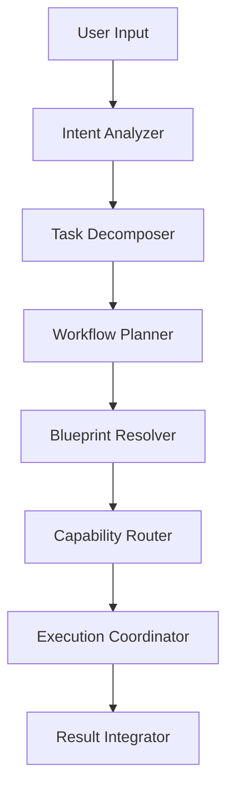
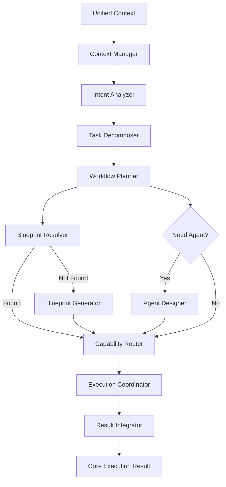
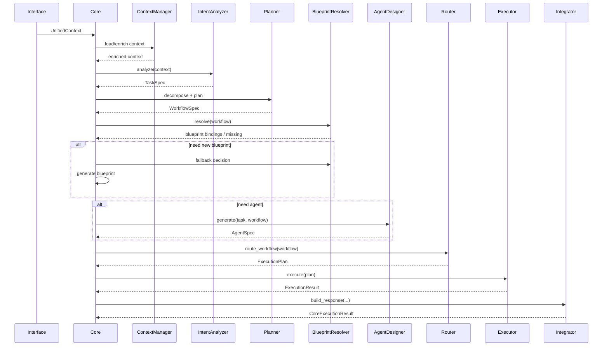
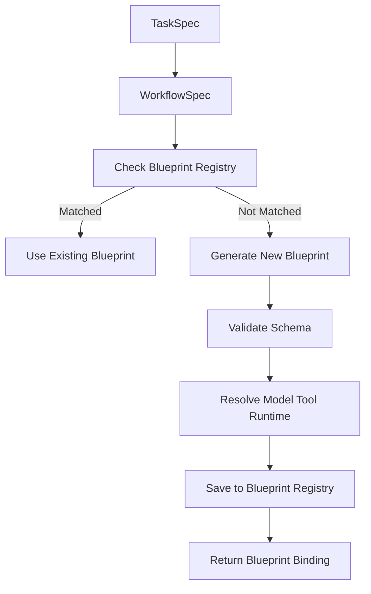
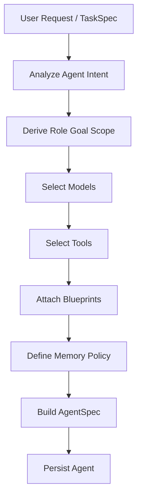

# AI Core 设计总文档

## 1. 文档说明

本文档用于定义整个系统中的 **AI Core**。
AI Core 不是单一模型，也不是单纯的聊天入口，而是系统中的 **AI 大脑**，负责统一理解输入、分析语义与语境、拆解任务、规划工作流、选择或生成蓝图、按需生成智能体，并自动为各步骤分配合适的模型、工具与运行技术。

本文档将 Core 作为整个系统的认知中心、决策中心与编排中心进行设计，目标是形成一份能够被 AI 与开发实现同时理解的统一规格文档。

---

## 2. Core 的定位

在整个系统架构中：

* API：负责传输
* Interface：负责输入归一化
* Core：负责思考、判断、规划、生成、调度
* Blueprint：负责可复用执行逻辑
* Feature：负责实际执行能力
* Environment Manager：负责运行环境准备
* Memory：负责状态与知识沉淀

因此，Core 的本质是一个：

* **认知中心（Cognition Center）**
* **决策中心（Decision Center）**
* **任务编排中心（Workflow Orchestrator）**
* **能力生成中心（Blueprint / Agent Generator）**
* **资源调度中心（Capability Router）**

Core 不是一个固定模型，而是一个多模块协同、多模型路由、多能力生成的中枢层。

---

## 3. Core 的目标

Core 的设计目标如下：

1. 对接入信息进行语义分析与语境分析
2. 将输入转换为可执行任务
3. 为复杂任务生成合理工作流
4. 判断已有蓝图是否可复用
5. 在缺少蓝图时自动生成蓝图
6. 在明确需要时自动生成智能体
7. 针对每个步骤自动选择最合适的模型、工具与技术
8. 统一组织执行与结果汇总
9. 将可复用逻辑沉淀为系统能力
10. 让系统具备持续演化能力

---

## 4. Core 的职责

### 4.1 输入理解与认知分析

Core 对接入信息进行深度分析，不只是提取表层语义，而是识别：

* 语义
* 语境
* 意图
* 目标
* 输出要求
* 约束条件
* 风险与边界
* 可用资源

### 4.2 任务拆解

Core 应将复杂输入拆解为多个可执行子任务。

### 4.3 工作流生成

Core 负责把子任务组织为工作流，而不是一次性把所有内容丢给单个模型。

### 4.4 蓝图选择与生成

Core 先判断系统中是否已有可复用 Blueprint；若无，则自动生成新 Blueprint。

### 4.5 智能体生成

当输入本质上是在定义一个长期可复用角色时，Core 不只是执行任务，而应创建智能体。

### 4.6 能力调度

Core 要根据每个步骤的目标，自动路由：

* 模型
* 工具
* 服务
* 运行环境

---

## 5. Core 的内部模块

建议将 Core 分为以下模块：

### 5.1 Context Manager

负责管理统一上下文、历史状态、任务环境、会话变量、记忆引用。

### 5.2 Intent Analyzer

负责识别输入意图、目标、约束、输出形式、领域属性。

### 5.3 Task Decomposer

负责把大任务拆解为多个具备依赖关系的子任务。

### 5.4 Workflow Planner

负责将任务树转换为可执行工作流图。

### 5.5 Blueprint Resolver

负责匹配已有 Blueprint，判断是否可直接复用。

### 5.6 Blueprint Generator

负责在缺少合适 Blueprint 时，自动生成新的 Blueprint。

### 5.7 Agent Designer

负责生成智能体定义，包括角色、职责、能力、模型策略、工具策略等。

### 5.8 Capability Router

负责将工作流节点映射到最合适的模型、工具、服务与执行环境。

### 5.9 Execution Coordinator

负责驱动工作流逐步执行，并处理结果回收、失败重试、状态推进。

### 5.10 Result Integrator

负责对执行结果做合并、过滤、格式化、输出封装。

---

## 6. Core 处理对象模型

Core 应统一管理四类对象：

### 6.1 Task

代表一次用户请求对应的主任务。

### 6.2 Workflow

代表任务被拆解后的执行图。

### 6.3 Blueprint

代表可复用执行逻辑。

### 6.4 Agent

代表具备角色、目标、能力与策略的一类长期或临时执行实体。

---

## 7. 模型与技术路由策略

Core 不绑定单一模型，而是根据任务类型进行模型和技术路由。

### 7.1 路由类任务

例如输入分类、意图识别、简单任务拆解、本地快速判断。

### 7.2 深度规划类任务

例如复杂任务拆解、多步骤工作流规划、复杂约束分析、智能体设计。

### 7.3 编码 / 蓝图生成类任务

例如生成 Blueprint、执行脚本、接口包装、Agent 配置。

### 7.4 文档生成类任务

例如报告、提案书、会议纪要、商务说明。

### 7.5 图片生成类任务

例如插图、海报、角色图、流程视觉稿。

### 7.6 Web 查询与总结类任务

例如查询最新资料、核实时效性内容、页面抓取与过滤、关键信息提取。

---

## 8. Core 的处理流程

### Step 1 输入进入 Core

Interface 已将原始输入统一为：

* Core Text Document
* Unified Context

### Step 2 Intent 分析

识别任务类型、输出要求、约束、联网需求、是否创建 Blueprint / Agent。

### Step 3 任务拆解

生成任务树与子任务依赖关系。

### Step 4 工作流规划

将任务树转换为工作流图。

### Step 5 蓝图匹配

优先匹配已有 Blueprint。

### Step 6 蓝图生成

若没有合适 Blueprint，则动态生成新 Blueprint。

### Step 7 智能体生成

若用户要求的是长期能力构建，则生成 Agent。

### Step 8 能力解析与资源分配

判断模型、工具、依赖、权限、执行位置。

### Step 9 工作流执行

按节点执行任务。

### Step 10 结果整合与沉淀

整合输出结果，并沉淀 Blueprint、Workflow Template、Agent Profile、Execution Metadata。

---

## 9. Core 的执行模式

### 9.1 普通任务模式

输入 → 分析 → 匹配能力 → 执行 → 输出

### 9.2 规划执行模式

输入 → 分析 → 拆解 → 工作流生成 → 执行 → 输出

### 9.3 蓝图生成模式

输入 → 分析 → 无可用 Blueprint → 生成 Blueprint → 执行 → 沉淀

### 9.4 智能体生成模式

输入 → 分析 → 生成 Agent Spec → 生成 Blueprint 集 → 配置模型与工具 → 保存 Agent

### 9.5 混合模式

同时需要 Agent + Blueprint + 执行的复合场景。

---

## 10. Core 的设计原则

### 10.1 Core 不是单模型入口

Core 是多模块、多模型、多能力协调层。

### 10.2 Core 不把 Blueprint 写死

Blueprint 可以预置、自动生成、动态组合，并演化为 Feature。

### 10.3 Core 把“生成能力”也视作能力

不仅执行任务，还能生成 Blueprint、Agent、工具包装层、流程模板。

### 10.4 Core 允许反馈修正

执行中发现信息不足、工具缺失、质量不足、环境不满足时，应支持重新规划。

### 10.5 Core 区分一次性任务与长期能力

Core 必须识别“执行一次”和“定义长期可复用能力”的区别。

### 10.6 Core 要面向演化设计

每次执行结束后，应尽可能沉淀为可复用资产，使系统持续成长。

---

## 11. 推荐的统一对象结构

### TaskSpec

```json
{
  "task_id": "task_001",
  "intent": "create_agent",
  "user_input": "帮我做一个提案书生成智能体",
  "domain": "business_document",
  "constraints": {
    "language": "ja",
    "tone": "formal"
  },
  "required_outputs": ["agent", "blueprint"]
}
```

### WorkflowSpec

```json
{
  "workflow_id": "wf_001",
  "task_id": "task_001",
  "mode": "agent_creation",
  "steps": [
    "analyze_agent_goal",
    "derive_capabilities",
    "select_models",
    "select_tools",
    "generate_blueprint",
    "generate_agent_profile",
    "persist_agent"
  ]
}
```

### BlueprintSpec

```json
{
  "blueprint_id": "bp_agent_proposal_writer",
  "name": "proposal_writer_blueprint",
  "purpose": "Generate Japanese business proposals",
  "inputs": ["project_context", "requirements", "references"],
  "outputs": ["proposal_docx", "summary_pdf"],
  "required_models": ["planner_model", "writer_model"],
  "required_tools": ["doc_generator", "web_research"],
  "runtime": "python"
}
```

### AgentSpec

```json
{
  "agent_id": "agent_001",
  "name": "proposal_writer_jp",
  "role": "Japanese proposal writer",
  "goals": ["write formal proposals", "summarize client requirements"],
  "model_policy": {
    "planning": "strong_reasoning_model",
    "writing": "document_specialized_model",
    "fact_check": "web_summary_model"
  },
  "tool_policy": ["file_reader", "web_research", "doc_export"],
  "blueprints": ["proposal_writer_blueprint"]
}
```

---

## 12. 总结

AI Core 是整个系统中的思考层、决策层和编排层。
它不只是理解输入，更要能够构造执行路径、生成系统能力、创建智能体，并自动完成模型与工具路由。

因此，Core 的最终目标不是“回答用户一句话”，而是：

> **把用户意图转化为可执行、可复用、可演化的系统能力。**

---

# 可编码 Core 实现规范（供代码生成）

## 1. 目录结构（Python / FastAPI + Service 架构）

```
core/
├── main.py
├── config/
│   └── settings.py
├── models/
│   ├── task.py
│   ├── workflow.py
│   ├── blueprint.py
│   ├── agent.py
│   └── context.py
├── services/
│   ├── context_manager.py
│   ├── intent_analyzer.py
│   ├── task_decomposer.py
│   ├── workflow_planner.py
│   ├── blueprint_resolver.py
│   ├── blueprint_generator.py
│   ├── agent_designer.py
│   ├── capability_router.py
│   ├── execution_coordinator.py
│   └── result_integrator.py
├── routers/
│   └── core_api.py
├── schemas/
│   ├── task_schema.py
│   ├── workflow_schema.py
│   ├── blueprint_schema.py
│   └── agent_schema.py
├── adapters/
│   ├── model_adapter.py
│   ├── tool_adapter.py
│   └── web_adapter.py
├── memory/
│   ├── vector_store.py
│   └── session_store.py
└── utils/
    ├── logger.py
    └── id_generator.py
```

---

## 2. 各目录职责说明

### models/

定义系统核心数据结构（领域模型）

### services/

Core 核心逻辑（每个模块对应一个能力单元）

### routers/

对外 API（FastAPI / webhook 接入）

### schemas/

输入输出校验（Pydantic）

### adapters/

对接外部能力（模型 / 工具 / Web）

### memory/

上下文与知识存储（向量数据库 / session）

### utils/

通用工具

---

## 3. 核心接口定义

### Core Orchestrator 接口

```python
class CoreEngine:
    async def handle(self, input_text: str, context: dict) -> dict:
        ...
```

---

### Intent Analyzer

```python
class IntentAnalyzer:
    async def analyze(self, text: str, context: dict) -> TaskSpec:
        ...
```

---

### Task Decomposer

```python
class TaskDecomposer:
    async def decompose(self, task: TaskSpec) -> list:
        ...
```

---

### Workflow Planner

```python
class WorkflowPlanner:
    async def plan(self, tasks: list) -> WorkflowSpec:
        ...
```

---

### Capability Router

```python
class CapabilityRouter:
    def route(self, step: dict) -> dict:
        ...
```

---

### Execution Coordinator

```python
class ExecutionCoordinator:
    async def execute(self, workflow: WorkflowSpec) -> dict:
        ...
```

---

## 4. Python 数据模型（Pydantic）

```python
from pydantic import BaseModel
from typing import List, Optional, Dict

class TaskSpec(BaseModel):
    task_id: str
    intent: str
    user_input: str
    domain: Optional[str]
    constraints: Dict
    required_outputs: List[str]

class WorkflowStep(BaseModel):
    step_id: str
    name: str
    depends_on: List[str] = []

class WorkflowSpec(BaseModel):
    workflow_id: str
    task_id: str
    steps: List[WorkflowStep]

class BlueprintSpec(BaseModel):
    blueprint_id: str
    name: str
    inputs: List[str]
    outputs: List[str]

class AgentSpec(BaseModel):
    agent_id: str
    name: str
    role: str
    goals: List[str]
```

---

## 5. JSON Schema（标准化接口）

### Task

```json
{
  "type": "object",
  "properties": {
    "task_id": {"type": "string"},
    "intent": {"type": "string"},
    "user_input": {"type": "string"}
  },
  "required": ["task_id", "intent", "user_input"]
}
```

---

### Workflow

```json
{
  "type": "object",
  "properties": {
    "workflow_id": {"type": "string"},
    "steps": {
      "type": "array",
      "items": {"type": "string"}
    }
  }
}
```

---

## 6. Mermaid 架构图



Core 内部模块图



Core 执行时序图


Blueprint 生成流程图



Agent 生成流程图



---

## 7. main.py 编排骨架

```python
from core.services.context_manager import ContextManager
from core.services.intent_analyzer import IntentAnalyzer
from core.services.task_decomposer import TaskDecomposer
from core.services.workflow_planner import WorkflowPlanner
from core.services.blueprint_resolver import BlueprintResolver
from core.services.blueprint_generator import BlueprintGenerator
from core.services.agent_designer import AgentDesigner
from core.services.capability_router import CapabilityRouter
from core.services.execution_coordinator import ExecutionCoordinator
from core.services.result_integrator import ResultIntegrator


class AICore:
    def __init__(
        self,
        context_manager: ContextManager,
        intent_analyzer: IntentAnalyzer,
        task_decomposer: TaskDecomposer,
        workflow_planner: WorkflowPlanner,
        blueprint_resolver: BlueprintResolver,
        blueprint_generator: BlueprintGenerator,
        agent_designer: AgentDesigner,
        capability_router: CapabilityRouter,
        execution_coordinator: ExecutionCoordinator,
        result_integrator: ResultIntegrator,
    ) -> None:
        self.context_manager = context_manager
        self.intent_analyzer = intent_analyzer
        self.task_decomposer = task_decomposer
        self.workflow_planner = workflow_planner
        self.blueprint_resolver = blueprint_resolver
        self.blueprint_generator = blueprint_generator
        self.agent_designer = agent_designer
        self.capability_router = capability_router
        self.execution_coordinator = execution_coordinator
        self.result_integrator = result_integrator

    def run(self, raw_context: dict):
        context = self.context_manager.load(raw_context)
        context = self.context_manager.enrich(context)

        task = self.intent_analyzer.analyze(context)
        subtasks = self.task_decomposer.decompose(task)
        workflow = self.workflow_planner.plan(task, subtasks)

        bindings = self.blueprint_resolver.resolve(workflow)

        generated_blueprints = []
        if not bindings:
            blueprint = self.blueprint_generator.generate(task, workflow)
            generated_blueprints.append(blueprint)

        generated_agents = []
        if task.requires_agent_generation:
            agent = self.agent_designer.generate(task, workflow)
            generated_agents.append(agent)

        plan = self.capability_router.route_workflow(workflow)
        execution_result = self.execution_coordinator.execute(plan)

        return self.result_integrator.build_response(
            task=task,
            workflow=workflow,
            execution_result=execution_result,
        )
```
sequenceDiagram
    participant Interface
    participant Core
    participant ContextManager
    participant IntentAnalyzer
    participant Planner
    participant BlueprintResolver
    participant AgentDesigner
    participant Router
    participant Executor
    participant Integrator

    Interface->>Core: UnifiedContext
    Core->>ContextManager: load/enrich context
    ContextManager-->>Core: enriched context

    Core->>IntentAnalyzer: analyze(context)
    IntentAnalyzer-->>Core: TaskSpec

    Core->>Planner: decompose + plan
    Planner-->>Core: WorkflowSpec

    Core->>BlueprintResolver: resolve(workflow)
    BlueprintResolver-->>Core: blueprint bindings / missing

    alt need new blueprint
        Core->>BlueprintResolver: fallback decision
        Core->>Core: generate blueprint
    end

    alt need agent
        Core->>AgentDesigner: generate(task, workflow)
        AgentDesigner-->>Core: AgentSpec
    end

    Core->>Router: route_workflow(workflow)
    Router-->>Core: ExecutionPlan

    Core->>Executor: execute(plan)
    Executor-->>Core: ExecutionResult

    Core->>Integrator: build_response(...)
    Integrator-->>Core: CoreExecutionResult
```
---

## 8. 关键实现建议

* 使用 FastAPI 作为入口
* 使用 asyncio 实现并发执行
* 使用 LangGraph / DAG 表达 workflow
* 使用向量数据库（Weaviate）作为 Memory
* 使用 Ollama / OpenAI 做模型路由

---

## 9. 下一步建议

下一阶段建议继续细化：

1. Workflow DSL（定义语言）
2. Blueprint 自动生成 Prompt
3. Agent 生命周期管理
4. 多模型策略引擎
5. 执行日志与可观测性

---