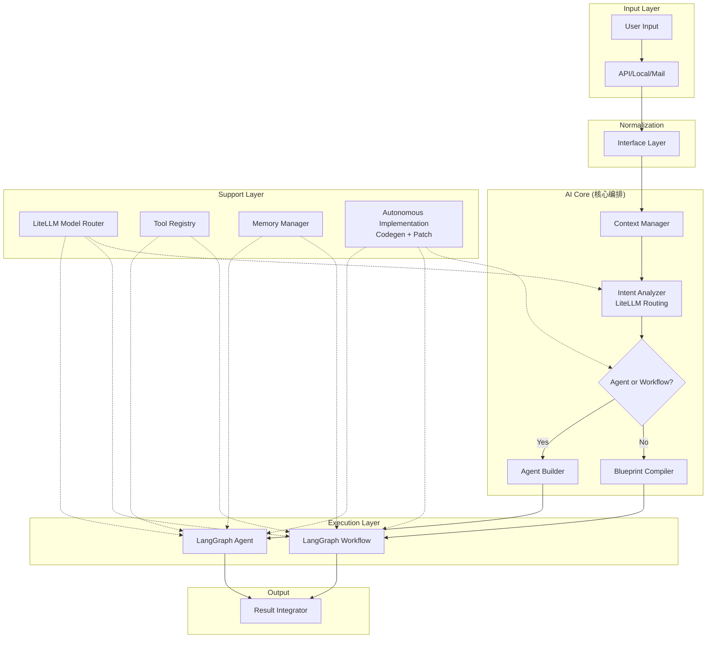
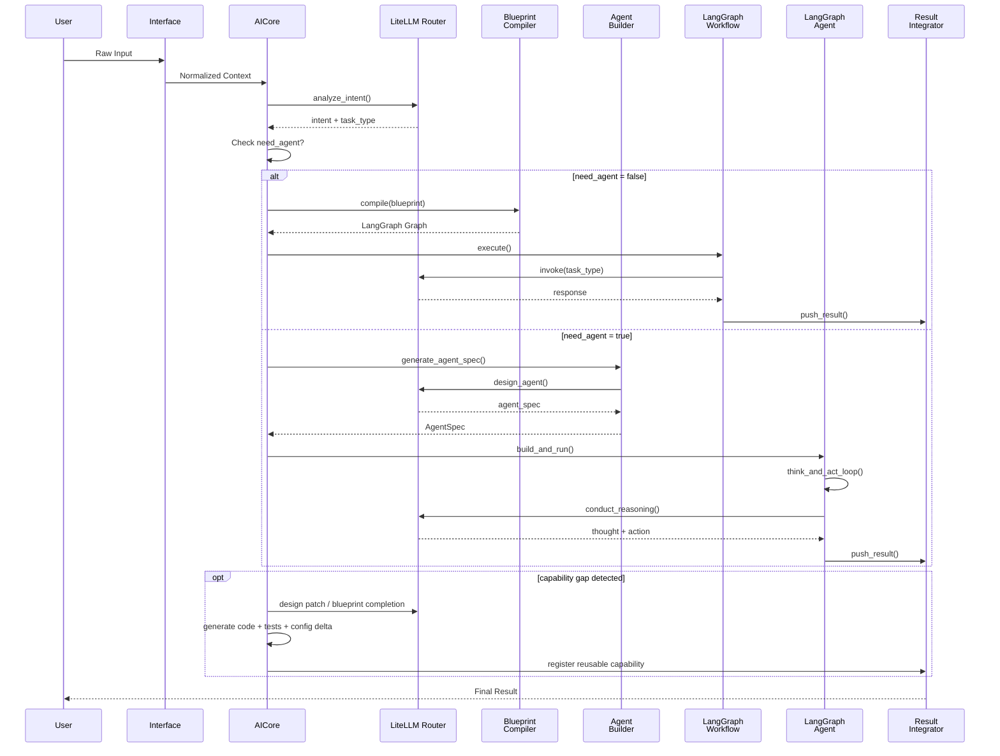

# AI Core 集成指南：LangGraph + LiteLLM 完整架构

---

## 1. 架构概览



---

## 2. 核心流程：从用户输入到执行

### 2.1 完整时序



---

## 3. 目录结构与文件对应

### 3.1 缺失能力补齐原则

AI Core 不只是消费既有能力，也允许在运行时判断“当前系统缺少实现，但可以通过代码生成补齐”。

推荐约束：

- 必须先尝试复用已有 Blueprint、Tool、Feature
- 仅在能力缺口明确时进入 codegen / patch 模式
- 新逻辑需要附带测试或回归验证
- 主配置保持只读，自动生成内容优先进入候选区、注册表或新文件
- 新实现完成后，应可被 BlueprintResolver / Registry 复用

```
nethub_runtime/
├── app/
│   ├── main.py                     ← 主启动入口
│   └── bootstrap.py
│
├── models/
│   ├── model_router.py             ← LiteLLM 核心
│   ├── prompts.py                  ← 系统提示词
│   └── model_config.yaml           ← 模型配置
│
├── core/
│   ├── main.py                     ← AI Core 编排
│   ├── schemas.py                  ← 数据模型
│   │
│   ├── workflows/
│   │   ├── base_workflow.py        ← 基础工作流
│   │   ├── blueprint_compiler.py   ← 蓝图编译器
│   │   └── executor.py             ← 工作流执行器
│   │
│   ├── agents/
│   │   ├── agent_spec.py           ← Agent规范
│   │   ├── agent_builder.py        ← Agent构建器
│   │   ├── reasoning_agent.py      ← 推理Agent
│   │   └── memory.py               ← Agent记忆
│   │
│   ├── tools/
│   │   ├── base_tool.py            ← 工具基类
│   │   ├── registry.py             ← 工具注册表
│   │   ├── web_search.py           ← Web工具
│   │   ├── filesystem.py           ← 文件系统工具
│   │   └── shell.py                ← Shell工具
│   │
│   └── debugging/
│       └── visualizer.py           ← 可视化工具
│
├── tvbox/
│   ├── main.py                     ← TVBox启动入口
│   ├── ui_service.py               ← UI服务
│   └── local_runtime.py            ← 本地运行环境
│
└── config/
    ├── model_config.yaml           ← 模型路由配置
    └── blueprints/                 ← 蓝图库
        ├── web_research.yaml
        ├── document_generation.yaml
        └── ...
```

---

## 4. 启动流程详解

### 4.1 标准启动（nesthub_runtime/app/main.py）

```python
# nethub_runtime/app/main.py

from nethub_runtime.app.bootstrap import bootstrap_runtime
from nethub_runtime.models.model_router import ModelRouter
from nethub_runtime.core.workflows.blueprint_compiler import BlueprintCompiler
from nethub_runtime.core.agents.agent_builder import AgentBuilder
from nethub_runtime.core.workflows.executor import WorkflowExecutor
from nethub_runtime.core.tools.registry import ToolRegistry
from nethub_runtime.core.main import AICore

def start_app() -> dict[str, Any]:
    """
    应用启动入口 - 标准模式
    
    初始化顺序：
    1. 运行时bootstrap
    2. LiteLLM模型路由器
    3. 工具注册表
    4. 蓝图编译器
    5. Agent构建器
    6. 工作流执行器
    7. AI Core编排器
    """
    
    LOGGER.info("🔧 [main.py] Initializing application...")
    
    # ========== 第1步：Runtime Bootstrap ==========
    context = bootstrap_runtime()
    LOGGER.info("✓ Runtime bootstrapped")
    
    # ========== 第2步：初始化 LiteLLM 模型路由器 ==========
    # docs/02_router/litellm_routing_design.md
    model_router = ModelRouter("config/model_config.yaml")
    context["model_router"] = model_router
    LOGGER.info("✓ LiteLLM Model Router initialized")
    
    # ========== 第3步：初始化工具注册表 ==========
    tool_registry = ToolRegistry()
    _register_default_tools(tool_registry)
    context["tool_registry"] = tool_registry
    LOGGER.info("✓ Tool Registry initialized")
    
    # ========== 第4步：初始化蓝图编译器 ==========
    # docs/03_workflow/langgraph_agent_framework.md
    blueprint_compiler = BlueprintCompiler(model_router, tool_registry)
    context["blueprint_compiler"] = blueprint_compiler
    LOGGER.info("✓ Blueprint Compiler initialized")
    
    # ========== 第5步：初始化 Agent 构建器 ==========
    # docs/03_workflow/langgraph_agent_framework.md
    agent_builder = AgentBuilder(model_router, tool_registry)
    context["agent_builder"] = agent_builder
    LOGGER.info("✓ Agent Builder initialized")
    
    # ========== 第6步：初始化工作流执行器 ==========
    workflow_executor = WorkflowExecutor(model_router, tool_registry)
    context["workflow_executor"] = workflow_executor
    LOGGER.info("✓ Workflow Executor initialized")
    
    # ========== 第7步：初始化 AI Core ==========
    core = AICore(
        model_router=model_router,
        blueprint_compiler=blueprint_compiler,
        agent_builder=agent_builder,
        workflow_executor=workflow_executor,
    )
    context["core"] = core
    LOGGER.info("✓ AI Core initialized")
    
    context["status"] = "ready"
    LOGGER.info("✅ Application initialized successfully")
    LOGGER.info(f"📊 Available components: {list(context.keys())}")
    
    return context


def _register_default_tools(registry: ToolRegistry):
    """注册默认工具"""
    from nethub_runtime.core.tools.web_search import WebSearchTool
    from nethub_runtime.core.tools.filesystem import FileSystemTool
    from nethub_runtime.core.tools.shell import ShellExecutionTool
    
    registry.register(WebSearchTool())
    registry.register(FileSystemTool())
    registry.register(ShellExecutionTool())
    
    LOGGER.info(f"✓ Registered {len(registry.list_all())} tools")


if __name__ == "__main__":
    import logging
    
    logging.basicConfig(
        level=logging.INFO,
        format="%(asctime)s [%(levelname)s] %(name)s - %(message)s",
    )
    
    ctx = start_app()
    
    print("\n" + "="*60)
    print("🚀 NestHub Application Status")
    print("="*60)
    for k, v in ctx.items():
        if k not in ['model_router', 'core', 'tool_registry']:
            print(f"  {k}: {v}")
    print("="*60)
```

### 4.2 TVBox 启动（nethub_runtime/tvbox/main.py）

```python
# nethub_runtime/tvbox/main.py

import logging
import asyncio
from typing import Any

from nethub_runtime.app.main import start_app
from nethub_runtime.tvbox.ui_service import TVBoxUIService
from nethub_runtime.tvbox.local_runtime import LocalRuntimeManager
from nethub_runtime.tvbox.lan_service import LANService

LOGGER = logging.getLogger("nethub_runtime.tvbox")

def start_tvbox() -> dict[str, Any]:
    """
    TVBox启动入口 - 本地运行时模式
    
    职责：
    1. 运行应用的完整初始化（与main.py相同）
    2. 初始化本地运行时管理器
    3. 启动UI服务
    4. 启动LAN服务（用于与其他设备通信）
    """
    
    LOGGER.info("📺 [tvbox/main.py] Starting TVBox Runtime...")
    
    # ========== 第1-7步：复用标准启动流程 ==========
    # 调用主启动函数，获得完整的应用context
    context = start_app()
    LOGGER.info("✓ Base application initialized (shared with main.py)")
    
    # ========== TVBox特定：初始化本地运行时管理器 ==========
    # 管理本地执行环境、进程、资源等
    local_runtime = LocalRuntimeManager(context)
    context["local_runtime"] = local_runtime
    LOGGER.info("✓ Local Runtime Manager initialized")
    
    # ========== TVBox特定：初始化UI服务 ==========
    # 提供Web或电视UI界面
    ui_service = TVBoxUIService(context)
    context["ui_service"] = ui_service
    LOGGER.info("✓ UI Service initialized")
    
    # ========== TVBox特定：启动LAN服务 ==========
    # 允许TVBox与外部设备通信
    lan_service = LANService(context)
    context["lan_service"] = lan_service
    LOGGER.info("✓ LAN Service initialized")
    
    # ========== 启动后台服务 ==========
    _start_background_services(context)
    
    LOGGER.info("✅ TVBox Runtime started successfully")
    LOGGER.info(f"📊 Local runtime features: {list(context.keys())}")
    
    return context


def _start_background_services(context: dict):
    """启动后台服务（API、UI等）"""
    
    from fastapi import FastAPI, WebSocket
    import uvicorn
    
    app = FastAPI(title="NestHub TVBox API")
    
    # ========== WebSocket 流式执行端点 ==========
    @app.websocket("/ws/execute/{execution_id}")
    async def websocket_execute(websocket: WebSocket, execution_id: str):
        """
        WebSocket流式执行
        用于实时推送执行结果到UI
        """
        await websocket.accept()
        
        try:
            while True:
                data = await websocket.receive_json()
                
                # 获取执行状态
                status = context["workflow_executor"].get_execution_status(execution_id)
                await websocket.send_json(status)
                
        except Exception as e:
            LOGGER.error(f"WebSocket error: {e}")
        finally:
            await websocket.close()
    
    # ========== REST 执行端点 ==========
    @app.post("/api/execute")
    async def execute(request: dict):
        """
        同步执行请求
        """
        user_input = request.get("input", "")
        context_data = request.get("context", {})
        
        # 调用AI Core处理
        result = await context["core"].handle(user_input, context_data)
        
        return result
    
    # ========== 状态查询端点 ==========
    @app.get("/api/status/{execution_id}")
    async def get_status(execution_id: str):
        """查询执行状态"""
        return context["workflow_executor"].get_execution_status(execution_id)
    
    # ========== 启动API服务器 ==========
    config = uvicorn.Config(app, host="0.0.0.0", port=8000, log_level="info")
    server = uvicorn.Server(config)
    
    # 在后台运行
    import threading
    api_thread = threading.Thread(target=lambda: asyncio.run(server.serve()))
    api_thread.daemon = True
    api_thread.start()
    
    LOGGER.info("✓ API Server started at http://0.0.0.0:8000")


if __name__ == "__main__":
    logging.basicConfig(
        level=logging.INFO,
        format="%(asctime)s [%(levelname)s] %(name)s - %(message)s",
    )
    
    ctx = start_tvbox()
    
    print("\n" + "="*60)
    print("📺 NestHub TVBox Status")
    print("="*60)
    print("  ✓ AI Core Initialized")
    print("  ✓ LiteLLM Routing Active")
    print("  ✓ LangGraph Workflows Ready")
    print("  ✓ Local Runtime Manager Active")
    print("  ✓ Web UI Server Running (http://0.0.0.0:8000)")
    print("="*60)
    
    # 保持运行
    try:
        while True:
            pass
    except KeyboardInterrupt:
        LOGGER.info("TVBox shutting down...")
```

---

## 5. 执行流程示例

### 5.1 简单意图 → Workflow 执行

```python
# 用户输入：搜索天气

async def example_workflow_execution():
    """
    Workflow执行流程示例
    """
    
    context = start_app()
    
    user_input = "帮我搜索北京今天的天气"
    
    # Step 1: 意图分析（LiteLLM）
    intent = await context["core"].analyze_intent(user_input)
    print(f"意图: {intent}")
    # Output: {"type": "web_search", "query": "北京天气"}
    
    # Step 2: 判断需要Agent还是Workflow
    # 结论：简单搜索，不需要Agent，用Workflow
    
    # Step 3: 编译蓝图为LangGraph
    blueprint = await context["blueprint_compiler"].compile(
        "examples/blueprints/web_research.yaml"
    )
    
    # Step 4: 执行LangGraph Workflow
    result = await context["workflow_executor"].execute_workflow(
        workflow_graph=blueprint,
        initial_input=user_input,
        context={"model_router": context["model_router"]}
    )
    
    print(f"结果: {result}")
```

### 5.2 复杂意图 → Agent 执行

```python
# 用户输入：帮我写一份市场研究报告，包括竞争对手分析和用户调研

async def example_agent_execution():
    """
    Agent执行流程示例
    """
    
    context = start_app()
    
    user_input = "帮我写一份针对AI视频生成工具的市场研究报告"
    
    # Step 1: 意图分析
    intent = await context["core"].analyze_intent(user_input)
    # Output: {"type": "complex_research", "requires_agent": True}
    
    # Step 2: 生成Agent规范
    agent_spec = await context["agent_builder"].generate_agent_spec(
        task=intent,
        workflow=None
    )
    
    print(f"Agent规范: {agent_spec}")
    
    # Step 3: 构建Agent
    agent = await context["agent_builder"].build_agent(agent_spec)
    
    # Step 4: 运行Agent的推理循环
    # Agent 自主决定：
    #   1. 思考: 需要搜索什么?
    #   2. 计划: 使用哪些工具?
    #   3. 行动: 执行Web搜索、信息提取等
    #   4. 评价: 结果是否足够?
    #   5. 循环或返回最终答案
    
    result = await agent.think_and_act(user_input, context)
    
    print(f"最终答案: {result['final_answer']}")
    print(f"推理步骤: {len(result['thoughts'])}")
    print(f"执行动作: {len(result['actions'])}")
```

---

## 6. 关键集成点

### 6.1 LiteLLM 路由集成

| 集成点 | 文件 | 用途 |
|-------|------|------|
| Intent Analysis | core/main.py | 意图分类 + 任务识别 |
| Task Planning | core/workflows/base_workflow.py | 任务拆解 |
| Code Generation | core/workflows/blueprint_compiler.py | 蓝图生成 |
| Agent Design | core/agents/agent_builder.py | Agent规范生成 |
| Reasoning Loop | core/agents/reasoning_agent.py | Agent推理 |

### 6.2 LangGraph 集成

| 集成点 | 文件 | 用途 |
|-------|------|------|
| Workflow State | core/schemas.py | 状态定义 |
| Base Workflow | core/workflows/base_workflow.py | 工作流模板 |
| Blueprint Compiler | core/workflows/blueprint_compiler.py | 蓝图 → LangGraph |
| Workflow Executor | core/workflows/executor.py | 执行引擎 |
| Agent State | core/schemas.py | Agent状态定义 |
| Reasoning Agent | core/agents/reasoning_agent.py | Agent核心 |

### 6.3 启动流程集成

```
main.py 启动流程:
  1. bootstrap_runtime() ← 环境准备
  2. ModelRouter() ← LiteLLM初始化
  3. ToolRegistry() ← 工具注册
  4. BlueprintCompiler() ← 蓝图编译
  5. AgentBuilder() ← Agent构建
  6. WorkflowExecutor() ← 执行引擎
  7. AICore() ← 编排器
  ↓
  返回context（所有组件都在这里）
  ↓
  可用于API、cli、tvbox等各种入口
```

---

## 7. 配置文件示例

### 7.1 MODEL_CONFIG.yaml

```yaml
# config/model_config.yaml

model_providers:
  ollama:
    base_url: "http://localhost:11434"
    timeout: 300
    models:
      - name: "qwen3:14b"
        enabled: true
        memory_gb: 8
  
  openai:
    api_key: "${OPENAI_API_KEY}"
    models:
      - name: "gpt-4o"
        enabled: true
      - name: "gpt-4.1"
        enabled: true

routing_policies:
  intent_analysis:
    primary: "ollama/qwen2.5:7b"
    fallback: ["gpt-4o-mini"]
    timeout_sec: 10
  
  task_planning:
    primary: "ollama/qwen3:14b"
    fallback: ["gpt-4o"]
    timeout_sec: 30
  
  agent_design:
    primary: "gpt-4o"
    fallback: ["claude-3-5-sonnet"]
    timeout_sec: 60
```

### 7.2 Blueprint Example

```yaml
# examples/blueprints/web_research.yaml

blueprint:
  id: "web_research_v1"
  name: "Web Research"
  
  workflow:
    steps:
      - id: "analyze_query"
        type: "llm"
        model: "intent_analysis"
        output: "query_plan"
      
      - id: "web_search"
        type: "tool"
        tool: "web_search"
        output: "search_results"
      
      - id: "summarize"
        type: "llm"
        model: "general_chat"
        output: "summary"
```

---

## 8. 最佳实践

### 8.1 何时使用 Workflow vs Agent

| 情景 | 选择 | 原因 |
|-----|------|------|
| 简单搜索查询 | Workflow | 任务固定、流程清晰 |
| 代码生成 | Workflow | 单步生成、模板化 |
| 研究报告编写 | Agent | 需要多步思考、自适应 |
| 问题解决 | Agent | 需要探索、反复尝试 |
| 数据分析 | Workflow | 流程固定、可预见 |

### 8.2 性能优化

```python
# 1. 缓存模型推理结果
model_router.cache_enabled = True

# 2. 并行执行工作流步骤
workflow.parallel_execution = True

# 3. 使用轻量级模型进行快速分类
use_lightweight_models_for_classification = True

# 4. Agent迭代限制
agent_spec.max_iterations = 5
```

### 8.3 错误处理

```python
# 完整的错误处理链

try:
    # 1. 意图分析
    intent = await core.analyze_intent(input)
except IntentAnalysisError as e:
    return {"error": "Failed to understand intent", "suggestion": "Try rephrasing"}

try:
    # 2. 执行工作流/Agent
    result = await executor.execute(workflow)
except ExecutionError as e:
    if e.retry_count < 3:
        # 重试
        result = await executor.execute_with_retry(workflow)
    else:
        return {"error": "Execution failed after retries"}
```

---

## 9. 监控与日志

```python
# 完整的执行链路跟踪

LOGGER.info(f"[TRACE:{trace_id}] User input received")
LOGGER.info(f"[TRACE:{trace_id}] Intent: {intent}")
LOGGER.info(f"[TRACE:{trace_id}] Selected: {'Workflow' if not need_agent else 'Agent'}")
LOGGER.info(f"[TRACE:{trace_id}] Model: {selected_model}")
LOGGER.info(f"[TRACE:{trace_id}] Execution started")
LOGGER.info(f"[TRACE:{trace_id}] Step {step_id} completed in {duration}ms")
LOGGER.info(f"[TRACE:{trace_id}] Total execution: {total_duration}ms")
```

---

## 10. 总结

```
完整的AI Core架构 = LiteLLM + LangGraph + 智能决策

启动流程：
  main.py
    ├─ LiteLLM Router (模型管理)
    ├─ LangGraph Workflow (任务编排)
    ├─ LangGraph Agent (AI推理)
    └─ AI Core Orchestrator (智能决策)
  
  tvbox/main.py
    └─ 继承所有上述组件 + 本地运行时

关键设计：
✓ 模型路由与选择由LiteLLM处理
✓ 工作流执行由LangGraph处理
✓ 决策与编排由AI Core处理
✓ 所有组件无耦合，可独立测试
✓ 支持动态配置与热更新
✓ 完整的可观测性与调试能力
```

---
