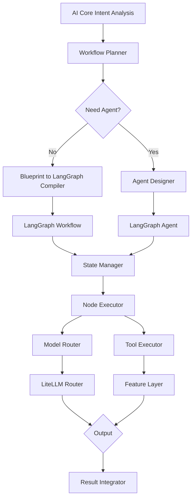

# LangGraph Workflow & Agent 框架设计规范

---

## 1. 设计目标

- 以 LangGraph 为核心的工作流（Workflow）与智能体（Agent）执行框架
- 支持复杂多步骤任务的编排与执行
- 蓝图（Blueprint）自动转换为 LangGraph 图结构
- 智能体（Agent）动态生成与持续推理
- 完整的状态管理与消息传递
- 支持人机协作与中断恢复
- 可视化执行流与调试支持

---

## 2. 总体架构



---

## 3. LangGraph 基础与工作流设计

### 3.1 工作流状态模型

```python
# nethub_runtime/core/schemas.py

from typing import TypedDict, Optional, List
from dataclasses import dataclass, field
from enum import Enum

class WorkflowState(TypedDict):
    """LangGraph 工作流状态"""
    
    # 输入
    user_input: str
    task_id: str
    context: dict
    
    # 中间状态
    intent: Optional[dict]
    plan: Optional[list]
    current_step: int
    
    # 执行结果
    results: list
    errors: list
    
    # 控制
    should_continue: bool
    retry_count: int
    
    # 审计
    timestamp: str
    trace_id: str
    

class AgentState(TypedDict):
    """LangGraph Agent 状态"""
    
    # Agent信息
    agent_id: str
    agent_name: str
    
    # 消息历史
    messages: List[dict]
    
    # 工具调用
    tool_calls: list
    tool_results: list
    
    # 思考过程
    thoughts: list
    actions_taken: list
    
    # 状态
    is_final: bool
    iterations: int
    max_iterations: int
```

### 3.2 基础工作流结构

```python
# nethub_runtime/core/workflows/base_workflow.py

from langgraph.graph import StateGraph, END
from nethub_runtime.core.schemas import WorkflowState
from nethub_runtime.models.model_router import ModelRouter
from typing import Any

class BaseWorkflow:
    """基础工作流模板"""
    
    def __init__(self, model_router: ModelRouter):
        self.model_router = model_router
        self.graph = None
    
    def build(self) -> StateGraph:
        """构建工作流图"""
        workflow = StateGraph(WorkflowState)
        
        # 添加节点
        workflow.add_node("analyze_intent", self.node_analyze_intent)
        workflow.add_node("plan_tasks", self.node_plan_tasks)
        workflow.add_node("execute_step", self.node_execute_step)
        workflow.add_node("integrate_results", self.node_integrate_results)
        
        # 添加条件边
        workflow.add_edge("analyze_intent", "plan_tasks")
        workflow.add_edge("plan_tasks", "execute_step")
        workflow.add_conditional_edges(
            "execute_step",
            self.should_continue_execution,
            {
                "continue": "execute_step",
                "finish": "integrate_results"
            }
        )
        workflow.add_edge("integrate_results", END)
        
        # 设置入口点
        workflow.set_entry_point("analyze_intent")
        
        self.graph = workflow.compile()
        return self.graph
    
    async def node_analyze_intent(self, state: WorkflowState) -> WorkflowState:
        """节点1：分析意图"""
        intent_response = await self.model_router.invoke(
            task_type="intent_analysis",
            prompt=state["user_input"]
        )
        
        state["intent"] = json.loads(intent_response)
        state["current_step"] = 1
        
        return state
    
    async def node_plan_tasks(self, state: WorkflowState) -> WorkflowState:
        """节点2：规划任务"""
        plan_response = await self.model_router.invoke(
            task_type="task_planning",
            prompt=f"为以下意图规划任务: {json.dumps(state['intent'])}"
        )
        
        state["plan"] = json.loads(plan_response)
        state["current_step"] = 2
        
        return state
    
    async def node_execute_step(self, state: WorkflowState) -> WorkflowState:
        """节点3：执行步骤"""
        if state["current_step"] >= len(state["plan"]):
            state["should_continue"] = False
            return state
        
        step = state["plan"][state["current_step"]]
        
        try:
            result = await self.execute_task_step(step, state)
            state["results"].append(result)
        except Exception as e:
            state["errors"].append(str(e))
            state["retry_count"] += 1
        
        state["current_step"] += 1
        return state
    
    async def node_integrate_results(self, state: WorkflowState) -> WorkflowState:
        """节点4：整合结果"""
        # 结果整合逻辑
        state["should_continue"] = False
        return state
    
    def should_continue_execution(self, state: WorkflowState) -> str:
        """条件节点：是否继续执行"""
        if state["retry_count"] > 3:
            return "finish"
        
        if state["current_step"] >= len(state.get("plan", [])):
            return "finish"
        
        return "continue"
    
    async def execute_task_step(self, step: dict, state: WorkflowState) -> Any:
        """执行单个任务步骤（由子类实现）"""
        raise NotImplementedError
    
    async def run(self, user_input: str, context: dict) -> dict:
        """运行工作流"""
        if not self.graph:
            self.build()
        
        initial_state: WorkflowState = {
            "user_input": user_input,
            "task_id": generate_task_id(),
            "context": context,
            "intent": None,
            "plan": None,
            "current_step": 0,
            "results": [],
            "errors": [],
            "should_continue": True,
            "retry_count": 0,
            "timestamp": datetime.now().isoformat(),
            "trace_id": generate_trace_id(),
        }
        
        final_state = await self.graph.ainvoke(initial_state)
        return final_state
```

---

## 4. 蓝图到 LangGraph 的编译

### 4.1 蓝图定义

```yaml
# examples/blueprints/web_research.yaml

blueprint:
  id: "web_research_v1"
  name: "Web Research Blueprint"
  version: "1.0"
  
  inputs:
    - name: "query"
      type: "string"
      required: true
    - name: "max_results"
      type: "integer"
      default: 5
  
  outputs:
    - name: "research_report"
      type: "dict"
    - name: "sources"
      type: "list"
  
  workflow:
    steps:
      - id: "query_analysis"
        type: "llm"
        model: "task_planning"
        input: "분석 검색 쿼리"
        output: "query_plan"
      
      - id: "web_search"
        type: "tool"
        tool: "web_search"
        input_from: "query_plan"
        output: "search_results"
      
      - id: "content_extract"
        type: "tool"
        tool: "content_extractor"
        input_from: "search_results"
        output: "extracted_content"
      
      - id: "summarize"
        type: "llm"
        model: "general_chat"
        input_from: "extracted_content"
        output: "summary"
      
      - id: "report_generate"
        type: "code"
        runtime: "python"
        input_from: ["summary", "search_results"]
        output: "research_report"
    
    edges:
      - from: "query_analysis"
        to: ["web_search"]
      - from: "web_search"
        to: ["content_extract"]
      - from: "content_extract"
        to: ["summarize", "report_generate"]
      - from: "summarize"
        to: ["report_generate"]
```

### 4.2 蓝图编译器

```python
# nethub_runtime/core/workflows/blueprint_compiler.py

import yaml
from langgraph.graph import StateGraph
from typing import Dict, Any

class BlueprintCompiler:
    """将蓝图YAML编译为LangGraph工作流"""
    
    def __init__(self, model_router, tool_registry):
        self.model_router = model_router
        self.tool_registry = tool_registry
    
    def compile(self, blueprint_path: str) -> StateGraph:
        """编译蓝图为LangGraph"""
        with open(blueprint_path, 'r') as f:
            blueprint = yaml.safe_load(f)
        
        workflow = StateGraph(WorkflowState)
        
        # 解析步骤
        steps = blueprint['workflow']['steps']
        
        # 添加所有节点
        for step in steps:
            node_func = self._create_node_function(step)
            workflow.add_node(step['id'], node_func)
        
        # 添加边
        edges = blueprint['workflow']['edges']
        for edge in edges:
            for to_step in edge['to']:
                workflow.add_edge(edge['from'], to_step)
        
        # 设置入口和出口
        workflow.set_entry_point(steps[0]['id'])
        workflow.add_edge(steps[-1]['id'], END)
        
        return workflow.compile()
    
    def _create_node_function(self, step: Dict[str, Any]):
        """根据步骤类型创建节点函数"""
        step_type = step['type']
        
        if step_type == 'llm':
            return self._create_llm_node(step)
        elif step_type == 'tool':
            return self._create_tool_node(step)
        elif step_type == 'code':
            return self._create_code_node(step)
        else:
            raise ValueError(f"Unknown step type: {step_type}")
    
    def _create_llm_node(self, step: Dict):
        """创建LLM节点"""
        async def node(state: WorkflowState) -> WorkflowState:
            prompt = step.get('input', '')
            model_task = step.get('model', 'general_chat')
            
            response = await self.model_router.invoke(
                task_type=model_task,
                prompt=prompt
            )
            
            state[step['output']] = response
            return state
        
        return node
    
    def _create_tool_node(self, step: Dict):
        """创建工具节点"""
        async def node(state: WorkflowState) -> WorkflowState:
            tool_name = step['tool']
            tool = self.tool_registry.get(tool_name)
            
            if not tool:
                raise ValueError(f"Tool not found: {tool_name}")
            
            input_data = state.get(step['input_from'], {})
            result = await tool.execute(input_data)
            
            state[step['output']] = result
            return state
        
        return node
    
    def _create_code_node(self, step: Dict):
        """创建代码节点"""
        async def node(state: WorkflowState) -> WorkflowState:
            # 代码执行逻辑
            runtime = step.get('runtime', 'python')
            # ... 实现代码执行
            return state
        
        return node
```

---

## 5. Agent 设计与动态生成

### 5.1 Agent 规范

```python
# nethub_runtime/core/agents/agent_spec.py

from dataclasses import dataclass
from typing import List, Dict, Optional

@dataclass
class AgentCapability:
    """Agent能力定义"""
    name: str
    description: str
    required_models: List[str]
    required_tools: List[str]
    required_blueprints: List[str]

@dataclass
class AgentSpec:
    """Agent规范"""
    agent_id: str
    name: str
    role: str
    description: str
    
    # 目标与范围
    goals: List[str]
    constraints: List[str]
    scope: str
    
    # 能力
    capabilities: List[AgentCapability]
    
    # 模型策略
    model_policy: Dict[str, str]  # task_type -> model
    
    # 工具策略
    tool_policy: List[str]
    
    # 内存策略
    memory_type: str  # "short_term" / "long_term" / "hybrid"
    memory_capacity: int
    
    # 执行策略
    max_iterations: int
    timeout_sec: int
    retry_policy: str
```

### 5.2 Agent Builder

```python
# nethub_runtime/core/agents/agent_builder.py

class AgentBuilder:
    """Agent构建器"""
    
    def __init__(self, model_router, tool_registry):
        self.model_router = model_router
        self.tool_registry = tool_registry
    
    async def generate_agent_spec(
        self,
        task: dict,
        workflow: dict
    ) -> AgentSpec:
        """
        AI生成Agent规范
        根据任务和工作流自动生成Agent定义
        """
        
        # 使用GPT生成Agent定义
        prompt = f"""
        根据以下任务和工作流生成一个高效的Agent：
        
        任务: {json.dumps(task)}
        工作流: {json.dumps(workflow)}
        
        返回包含以下内容的JSON：
        - agent_name: Agent名称
        - role: 角色描述
        - goals: 目标列表
        - capabilities: 能力列表
        - model_policy: 模型策略
        - tool_policy: 工具策略
        """
        
        response = await self.model_router.invoke(
            task_type="agent_design",
            prompt=prompt
        )
        
        spec_dict = json.loads(response)
        return AgentSpec(**spec_dict)
    
    async def build_agent(self, spec: AgentSpec) -> "ReasoningAgent":
        """根据规范构建Agent"""
        agent = ReasoningAgent(
            spec=spec,
            model_router=self.model_router,
            tool_registry=self.tool_registry
        )
        
        await agent.initialize()
        return agent
```

### 5.3 推理型 Agent（核心）

```python
# nethub_runtime/core/agents/reasoning_agent.py

from langgraph.graph import StateGraph, END
from langgraph.prebuilt import create_react_agent
from nethub_runtime.core.schemas import AgentState
import json

class ReasoningAgent:
    """持续推理型Agent"""
    
    def __init__(self, spec: AgentSpec, model_router, tool_registry):
        self.spec = spec
        self.model_router = model_router
        self.tool_registry = tool_registry
        self.graph = None
        self.memory = {}
    
    async def initialize(self):
        """初始化Agent"""
        LOGGER.info(f"🤖 Initializing Agent: {self.spec.name}")
        
        self.graph = await self._build_agent_graph()
    
    async def _build_agent_graph(self) -> StateGraph:
        """构建Agent推理图"""
        
        # 注册工具
        tools = []
        for tool_name in self.spec.tool_policy:
            tool = self.tool_registry.get(tool_name)
            if tool:
                tools.append(tool)
        
        # 使用LangGraph的ReAct Agent
        agent_executor = create_react_agent(
            model=self.model_router,
            tools=tools,
            state_schema=AgentState,
        )
        
        return agent_executor
    
    async def think_and_act(self, input_text: str, context: dict) -> dict:
        """
        Agent的核心推理循环
        
        Loop:
        1. 观察（Observe） - 获取消息
        2. 思考（Think） - 使用LLM推理
        3. 计划（Plan） - 规划行动
        4. 行动（Act） - 执行工具/代码
        5. 评价（Evaluate） - 评价结果
        6. 循环或返回
        """
        
        messages = [{"role": "user", "content": input_text}]
        
        state: AgentState = {
            "agent_id": self.spec.agent_id,
            "agent_name": self.spec.name,
            "messages": messages,
            "tool_calls": [],
            "tool_results": [],
            "thoughts": [],
            "actions_taken": [],
            "is_final": False,
            "iterations": 0,
            "max_iterations": self.spec.max_iterations,
        }
        
        # 运行推理循环
        while state["iterations"] < self.spec.max_iterations and not state["is_final"]:
            
            # 1. 思考
            thought = await self._conduct_reasoning(state)
            state["thoughts"].append(thought)
            
            # 2. 决定行动
            action = await self._plan_action(state, thought)
            state["actions_taken"].append(action)
            
            # 3. 执行行动
            if action["type"] == "tool_call":
                result = await self._execute_tool(action)
                state["tool_calls"].append(action)
                state["tool_results"].append(result)
            
            elif action["type"] == "final_answer":
                state["is_final"] = True
                state["messages"].append({
                    "role": "assistant",
                    "content": action["answer"]
                })
            
            state["iterations"] += 1
        
        return {
            "agent_id": self.spec.agent_id,
            "final_answer": state["messages"][-1]["content"],
            "thoughts": state["thoughts"],
            "actions": state["actions_taken"],
            "iterations": state["iterations"],
        }
    
    async def _conduct_reasoning(self, state: AgentState) -> dict:
        """进行推理"""
        
        # 构建推理提示
        prompt = f"""
        角色: {self.spec.role}
        目标: {', '.join(self.spec.goals)}
        
        当前消息: {json.dumps(state['messages'][-1])}
        
        根据上下文和目标进行推理。
        思考下一步应该做什么。
        
        返回JSON格式的推理结果，包含：
        - reasoning: 推理过程
        - next_action_type: "tool_call" 或 "final_answer"
        - confidence: 置信度 0-1
        """
        
        response = await self.model_router.invoke(
            task_type="agent_reasoning",
            prompt=prompt
        )
        
        return json.loads(response)
    
    async def _plan_action(self, state: AgentState, thought: dict) -> dict:
        """规划行动"""
        
        # 根据思考结果决定行动
        next_action = thought.get("next_action_type", "tool_call")
        
        if next_action == "final_answer":
            return {
                "type": "final_answer",
                "answer": thought.get("reasoning", "")
            }
        
        # 决定使用哪个工具
        tool_name = await self._select_tool(thought)
        
        return {
            "type": "tool_call",
            "tool": tool_name,
            "input": thought.get("tool_input", {})
        }
    
    async def _select_tool(self, thought: dict) -> str:
        """根据思考内容选择工具"""
        # 实现工具选择逻辑
        return thought.get("suggested_tool", self.spec.tool_policy[0])
    
    async def _execute_tool(self, action: dict) -> dict:
        """执行工具"""
        tool_name = action["tool"]
        tool = self.tool_registry.get(tool_name)
        
        if not tool:
            return {"error": f"Tool not found: {tool_name}"}
        
        try:
            result = await tool.execute(action.get("input", {}))
            return {"success": True, "result": result}
        except Exception as e:
            return {"success": False, "error": str(e)}
```

---

## 6. 工作流执行与状态管理

### 6.1 工作流执行器

```python
# nethub_runtime/core/workflows/executor.py

class WorkflowExecutor:
    """工作流执行引擎"""
    
    def __init__(self, model_router, tool_registry):
        self.model_router = model_router
        self.tool_registry = tool_registry
        self.active_executions = {}
    
    async def execute_workflow(
        self,
        workflow_graph,
        initial_input: str,
        context: dict,
        execution_id: str
    ) -> dict:
        """执行工作流"""
        
        LOGGER.info(f"🚀 Starting workflow execution: {execution_id}")
        
        try:
            # 运行工作流
            final_state = await workflow_graph.ainvoke({
                "user_input": initial_input,
                "task_id": execution_id,
                "context": context,
                # ... 其他初始状态
            })
            
            self.active_executions[execution_id] = {
                "status": "completed",
                "result": final_state
            }
            
            return final_state
            
        except Exception as e:
            LOGGER.error(f"❌ Workflow execution failed: {e}")
            
            self.active_executions[execution_id] = {
                "status": "failed",
                "error": str(e)
            }
            
            raise
    
    def get_execution_status(self, execution_id: str) -> dict:
        """获取执行状态"""
        return self.active_executions.get(execution_id, {})
```

---

## 7. 工具与能力注册

### 7.1 工具基类

```python
# nethub_runtime/core/tools/base_tool.py

from abc import ABC, abstractmethod
from typing import Any, Dict

class BaseTool(ABC):
    """工具基类"""
    
    def __init__(self, name: str, description: str):
        self.name = name
        self.description = description
    
    @abstractmethod
    async def execute(self, input_data: Dict[str, Any]) -> Any:
        """执行工具"""
        pass
    
    def get_schema(self) -> Dict:
        """获取工具schema（用于Agent调用）"""
        return {
            "name": self.name,
            "description": self.description,
            "input_schema": {...}
        }
```

### 7.2 工具注册表

```python
# nethub_runtime/core/tools/registry.py

class ToolRegistry:
    """工具注册表"""
    
    def __init__(self):
        self.tools = {}
    
    def register(self, tool: BaseTool):
        """注册工具"""
        self.tools[tool.name] = tool
        LOGGER.info(f"✓ Tool registered: {tool.name}")
    
    def get(self, name: str) -> Optional[BaseTool]:
        """获取工具"""
        return self.tools.get(name)
    
    def list_all(self) -> List[str]:
        """列出所有工具"""
        return list(self.tools.keys())
```

---

## 8. 与main.py的集成

### 8.1 启动流程

```python
# nethub_runtime/app/main.py

from nethub_runtime.core.workflows.blueprint_compiler import BlueprintCompiler
from nethub_runtime.core.agents.agent_builder import AgentBuilder
from nethub_runtime.core.workflows.executor import WorkflowExecutor
from nethub_runtime.core.tools.registry import ToolRegistry

def start_app() -> dict[str, Any]:
    """应用初始化（整体启动流程）"""
    
    LOGGER.info("🔧 Initializing application...")
    
    # 1. 标准bootstrap
    context = bootstrap_runtime()
    
    # 2. 初始化LiteLLM路由器
    model_router = ModelRouter("config/model_config.yaml")
    context["model_router"] = model_router
    
    # 3. 初始化工具注册表
    tool_registry = ToolRegistry()
    _register_default_tools(tool_registry)
    context["tool_registry"] = tool_registry
    
    # 4. 初始化蓝图编译器
    blueprint_compiler = BlueprintCompiler(model_router, tool_registry)
    context["blueprint_compiler"] = blueprint_compiler
    
    # 5. 初始化Agent构建器
    agent_builder = AgentBuilder(model_router, tool_registry)
    context["agent_builder"] = agent_builder
    
    # 6. 初始化工作流执行器
    workflow_executor = WorkflowExecutor(model_router, tool_registry)
    context["workflow_executor"] = workflow_executor
    
    # 7. 初始化AI Core
    core = AICore(
        model_router=model_router,
        blueprint_compiler=blueprint_compiler,
        agent_builder=agent_builder,
        workflow_executor=workflow_executor
    )
    context["core"] = core
    
    LOGGER.info("✅ Application initialized with LangGraph + LiteLLM")
    
    return context

def _register_default_tools(registry: ToolRegistry):
    """注册默认工具"""
    registry.register(WebSearchTool())
    registry.register(FileSystemTool())
    registry.register(ShellExecutionTool())
    # ... 更多工具
```

---

## 9. TVBox 启动入口

```python
# nethub_runtime/tvbox/main.py

import logging
from nethub_runtime.app.main import start_app
from nethub_runtime.tvbox.ui_service import TVBoxUIService
from nethub_runtime.tvbox.local_runtime import LocalRuntimeManager

LOGGER = logging.getLogger("nethub_runtime.tvbox")

def start_tvbox() -> dict:
    """
    TVBox启动入口
    - 本地AI Core运行时
    - 本地UI服务
    - LAN设备控制
    """
    
    LOGGER.info("📺 Starting TVBox Runtime...")
    
    # 1. 初始化应用（共享与main.py）
    context = start_app()
    
    # 2. 初始化本地运行时管理器
    local_runtime = LocalRuntimeManager(context)
    context["local_runtime"] = local_runtime
    
    # 3. 初始化UI服务
    ui_service = TVBoxUIService(context)
    context["ui_service"] = ui_service
    
    # 4. 启动本地API服务器
    _start_local_api_server(context)
    
    LOGGER.info("✅ TVBox Runtime started")
    
    return context

def _start_local_api_server(context: dict):
    """启动本地API服务器（用于LAN通信）"""
    from fastapi import FastAPI
    import uvicorn
    
    app = FastAPI()
    
    @app.post("/stream/{execution_id}")
    async def stream_execution(execution_id: str):
        """流式执行工作流"""
        # ... 实现
        pass
    
    @app.get("/status/{execution_id}")
    async def get_status(execution_id: str):
        """获取执行状态"""
        return context["workflow_executor"].get_execution_status(execution_id)
    
    # 后台运行
    uvicorn.run(app, host="0.0.0.0", port=8000)

if __name__ == "__main__":
    logging.basicConfig(level=logging.INFO)
    start_tvbox()
```

---

## 10. 执行流示例

```python
# 完整的执行流程

async def handle_user_input(user_input: str, context: dict):
    """
    完整的AI Core执行流程
    """
    
    # 1. 意图分析（LiteLLM路由）
    intent = await context["core"].analyze_intent(user_input)
    
    # 2. 判断是否需要Agent
    if intent.get("requires_agent"):
        # 3a. 使用Agent（持续推理）
        
        # 生成Agent规范
        agent_spec = await context["agent_builder"].generate_agent_spec(
            task=intent,
            workflow=None  # Agent管理自己的工作流
        )
        
        # 构建Agent
        agent = await context["agent_builder"].build_agent(agent_spec)
        
        # 执行Agent推理
        result = await agent.think_and_act(user_input, context)
        
    else:
        # 3b. 使用Workflow（任务编排）
        
        # 获取或编译蓝图
        blueprint = await context["blueprint_compiler"].compile(
            "examples/blueprints/web_research.yaml"
        )
        
        # 执行工作流
        result = await context["workflow_executor"].execute_workflow(
            workflow_graph=blueprint,
            initial_input=user_input,
            context=context
        )
    
    return result
```

---

## 11. 调试与可视化

```python
# nethub_runtime/core/debugging/visualizer.py

class WorkflowVisualizer:
    """工作流可视化"""
    
    @staticmethod
    def visualize_execution(state: dict) -> str:
        """生成Mermaid图表"""
        
        mermaid = "graph TD\n"
        
        for step in state.get("plan", []):
            mermaid += f'    {step["id"]}["{step["name"]}"]\n'
        
        # ... 添加边
        
        return mermaid
    
    @staticmethod
    def export_trace(execution_id: str, output_path: str):
        """导出执行轨迹"""
        # 导出为JSON或HTML
        pass
```

---

## 12. 总结

```
LangGraph工作流 = 任务编排执行引擎
LangGraph Agent = 持续推理与自主决策

完整栈：
  
  用户输入
    ↓
  [LiteLLM路由] → 意图分析
    ↓
  [决策层] → 需要Agent？
    ├─ Yes → [Agent构建] → [推理循环]
    └─ No → [蓝图编译] → [工作流执行]
    ↓
  [结果整合]
    ↓
  返回结果

集成点：

✓ models/model_router.py ← LiteLLM路由
✓ core/workflows/* ← LangGraph工作流
✓ core/agents/* ← LangGraph Agent
✓ app/main.py ← 主启动入口
✓ tvbox/main.py ← TVBox启动入口
```

---
