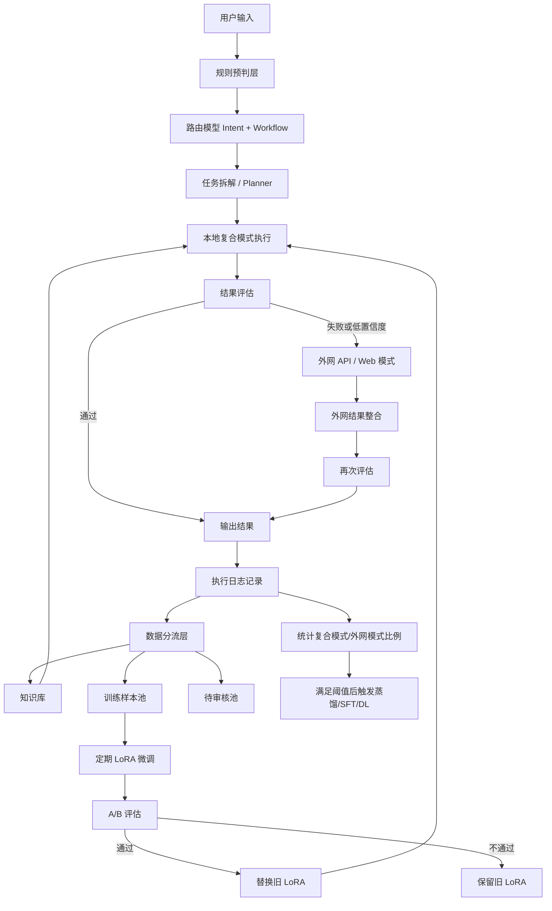
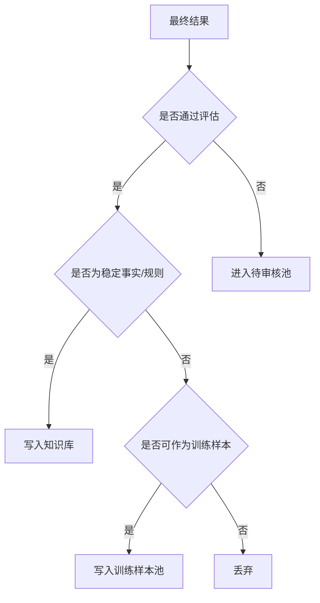
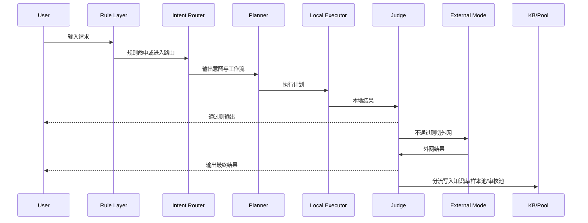
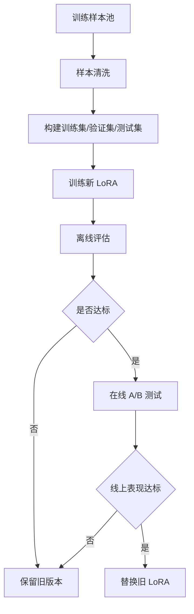

# 本地模型 + LoRA + 外网 API 的完整执行方案

## 1. 方案目标

构建一个可持续演进的 AI 执行系统，满足以下目标：

1. 优先使用本地模型完成任务，降低成本、保护数据隐私、提升可控性
2. 使用 LoRA 增强本地模型在特定业务领域中的理解与输出能力
3. 当本地复合模式无法稳定完成任务时，自动切换到外网 API / Web 模式兜底
4. 将执行过程中的高质量结果沉淀到知识库与训练样本池中
5. 定期基于高质量样本进行 LoRA 微调，持续替换旧版本 LoRA
6. 当本地复合模式的覆盖率、成功率与质量达到阈值后，触发更高层级的模型蒸馏 / SFT / 新模型训练
7. 形成“执行 → 评估 → 沉淀 → 微调 → 升级 → 再执行”的闭环体系

---

## 2. 设计原则

### 2.1 本地优先
默认优先走本地复合模式：
- 本地底模
- 本地 LoRA
- 本地知识库 / RAG
- 本地规则与工作流引擎

### 2.2 外网兜底
仅在以下场景切换外网模式：
- 本地结果置信度不足
- 本地无法召回足够知识
- 任务需要最新外部信息
- 任务属于高复杂度推理 / 规划
- 本地输出格式或关键字段校验失败

### 2.3 分层执行
不是一个模型干所有事情，而是分角色执行：
- 路由模型
- 规划模型
- 执行模型
- 评估模型

### 2.4 数据分层沉淀
不是所有结果都直接进入知识库，必须分流：
- 知识库
- 训练样本池
- 待审核池
- 丢弃池

### 2.5 版本化演进
- LoRA 必须版本化
- 工作流模板必须版本化
- 训练集必须版本化
- 评估指标必须可追踪

---

## 3. 总体架构


---

## 4. 模型分层设计
### 4.1 规则预判层
作用:在进入模型前，先用轻量规则处理高频、明确任务，减少模型开销。

#### 适用场景
- 包含明显关键词的任务
- 格式固定的任务
- 高频重复业务动作

#### 示例规则
- 包含“提醒”“明天”“后天”“日程” → calendar
- 包含“花了”“消费”“金额”“买菜” → expense_record
- 包含“整理文档”“总结”“提取要点” → document_summary
- 包含“查一下”“最新”“价格”“官网” → external_lookup

#### 参考输出格式
```json
{
  "rule_hit": true,
  "intent": "expense_record",
  "workflow": "record_expense",
  "confidence": 0.82
}
```

### 4.2 路由模型（Intent Router）
作用： 识别用户意图，并判断应该进入哪种工作流。

#### 输入
- 用户原始输入
- 最近上下文
- 用户历史偏好
- 当前系统状态

#### 参考输出格式
```json
{
  "intent": "expense_record",
  "workflow": "record_expense",
  "need_rag": true,
  "need_external": false,
  "complexity": "low",
  "confidence": 0.93
}
```

#### 典型意图分类
- expense_record
- schedule_create
- reminder_create
- document_summary
- document_structuring
- faq_answer
- web_lookup
- comparison
- workflow_generation
- agent_creation
- data_extraction
- 建议模型
- 本地小模型
- 小参数量分类模型
- LoRA 强化后的轻量模型
- 要求
- 快速
- 低成本
- 输出稳定 JSON
- 能做简单多标签判断

### 4.3 工作流拆解模型（Planner）
作用: 将复杂自然语言任务拆解成可执行步骤。

#### 输入
- 路由结果
- 用户输入
- 上下文
- 可用工具列表
- 工作流模板库

#### 参考输出格式
```json
{
  "workflow": "meeting_action_pipeline",
  "steps": [
    {"step": 1, "action": "read_document"},
    {"step": 2, "action": "extract_action_items"},
    {"step": 3, "action": "identify_assignees"},
    {"step": 4, "action": "identify_due_dates"},
    {"step": 5, "action": "write_task_db"},
    {"step": 6, "action": "create_reminders"}
  ],
  "need_external": false,
  "confidence": 0.88
}
```

#### 工作流拆解层次
- 单步骤任务
- 多步骤串行任务
- 多步骤并行任务
- 多 Agent 协作任务
- 人机交互补充型任务

#### 建议模型
- 本地主模型
- 本地主模型 + Planner LoRA
- 必要时外网大模型兜底规划

### 4.4 本地执行模型（Executor）
作用: 真正完成任务执行。

#### 典型执行内容
- 结构化抽取
- 文档摘要
- 多语言转换
- 业务问答
- 任务列表生成
- 标准 JSON 输出
- Prompt 生成
- Workflow YAML / JSON 生成

#### 输入组成
- 用户输入
- Planner 输出
- RAG 召回内容
- 业务规则
- 输出 Schema

#### 执行模式
<font face="黑体">模式 A：纯本地</font>
    - 本地底模
    - 不用 LoRA
    - 不用外网

<font face="黑体">模式 B：本地复合模式</font>
    - 本地底模
    - 加载业务 LoRA
    - 结合知识库 RAG
    - 配合规则引擎

这是主力模式。

#### 参考输出示例
```json
{
  "answer": "已为妈妈记录消费 2000 日元，内容为买菜。",
  "structured_data": {
    "person": "妈妈",
    "item": "买菜",
    "amount": 2000,
    "currency": "JPY",
    "date": "2026-04-21"
  },
  "confidence": 0.91
}
```

### 4.5 评估模型（Judge / Evaluator）
作用：判断执行结果是否可接受，并决定是否进入外网兜底。

#### 评估维度
- 结构完整性
- 字段完整性
- 逻辑一致性
- 与知识库一致性
- 用户意图匹配度
- 输出格式合法性
- 可入库性

#### 参考输出示例
```json
{
  "pass": false,
  "score": 0.67,
  "issues": [
    "missing_due_date",
    "insufficient_context",
    "low_fact_support"
  ],
  "should_fallback_external": true,
  "can_store_to_kb": false,
  "can_store_to_training_pool": true
}
```

#### 评估方式
- 规则校验
- JSON Schema 校验
- 小模型判定
- 主模型二次审查
- 用户反馈校正

### 4.6 外网执行模式（Fallback Mode）
作用：当本地复合模式失败、低置信度或需要最新外部信息时，切换外部能力。

#### 外网模式包括
- 外部 LLM API
- Web 搜索
- 官方 API 查询
- 第三方工具调用

#### 触发条件
- 本地评估分数低于阈值
- 任务明确要求“最新”“当前”“官网”
- 本地知识不足
- 本地规划失败
- 本地结果字段缺失严重

#### 输出要求
- 外网结果不能直接全量入知识库，必须再次评估与清洗。

## 5. 知识库与训练样本的分层沉淀方案
### 5.1 数据分层

#### A. 知识库（KB）
适合存放：
- 经确认的事实
- 业务规则
- 标准流程
- 用户确认后的案例
- 工具执行结果摘要

#### B. 训练样本池（Training Pool）
适合存放：
- 用户输入
- 任务意图
- 工作流拆解结果
- 本地输出
- 外网输出
- 用户最终修正版本
- 最终采纳版本

#### C. 待审核池（Review Pool）
适合存放：
- 冲突内容
- 低置信度内容
- 外网结果未经验证内容
- 多候选答案

#### D. 丢弃池（Discard）
- 明显幻觉
- 重复噪音
- 无业务价值的临时内容

### 5.2 数据分流逻辑


## 6. LoRA 微调方案
### 6.1 LoRA 的定位
LoRA 适合增强：
- 业务术语
- 输出格式
- 意图分类
- 工作流选择
- 结构化抽取
- 特定风格回答
- 多语言业务表达

LoRA 不适合单独承担：
- 大幅提升底层推理能力
- 替代知识库
- 替代最新外部知识

### 6.2 LoRA 训练数据来源

训练集来自：
- 高质量训练样本池
- 用户确认后的最终答案
- 高质量外网兜底结果
- 评估通过的本地结果
- 人工修正后的标准样例

#### 样本格式建议
```json
{
  "instruction": "帮我记录一下妈妈今天买菜花了2000日元",
  "context": "",
  "output": {
    "intent": "expense_record",
    "structured_data": {
      "person": "妈妈",
      "item": "买菜",
      "amount": 2000,
      "currency": "JPY"
    }
  },
  "quality_score": 0.97,
  "source": "user_confirmed"
}
```

### 6.3 LoRA 训练周期

建议周期：
- 高频业务：每周
- 中频业务：双周
- 稳定系统：每月

每次训练流程
- 从训练样本池提取高质量样本
- 清洗与去重
- 划分训练集 / 验证集 / 测试集
- 训练新 LoRA
- 执行离线评估
- 执行在线 A/B 测试
- 达标后替换旧 LoRA


### 6.4 LoRA 替换规则
#### 替换条件
- 新 LoRA 在验证集准确率更高
- JSON 输出更稳定
- 用户修正率更低
- 平均耗时无明显恶化
- 外网兜底率下降

#### 回滚条件
- 幻觉率上升
- 格式错误率上升
- 关键任务成功率下降
- 用户投诉增多

## 7. 本地复合模式与外网模式的比例管理
### 7.1 需要记录的核心比例
#### 1. 请求进入比例
- 多少请求先进入本地复合模式
- 多少请求直接进入外网模式
#### 2. 本地独立完成比例
- 不依赖外网即可成功完成的比例
#### 3. 本地失败兜底比例
- 本地失败后切到外网的比例
#### 4. 最终结果采用比例
- 最终答案中，本地结果占比
- 最终答案中，外网结果占比
#### 5. 用户接受比例
- 用户是否直接接受本地结果
- 是否需要手动修正

### 7.2 统计表示例
```json
{
  "date": "2026-04-21",
  "total_requests": 1000,
  "local_first_requests": 920,
  "external_direct_requests": 80,
  "local_success": 870,
  "local_failed_to_external": 50,
  "external_success": 74,
  "user_accept_local": 820,
  "user_modified_local": 50,
  "local_success_rate": 0.945,
  "external_fallback_rate": 0.054,
  "user_accept_rate": 0.943
}
```

## 8. 触发新模型训练 / 蒸馏 / DL 的条件

### 8.1 建议触发条件

同时满足以下条件时，触发更高层级模型升级：
- 本地复合模式覆盖率 > 95%
- 本地复合模式成功率 > 90%
- 用户人工修正率 < 5%
- 外网兜底率连续下降
- 样本池已有足够高质量数据
- 当前 LoRA 升级收益开始变小
- 高价值任务在本地已经稳定完成

### 8.2 升级路径
#### 路径 A：继续训练新 LoRA
- 适合轻量升级
#### 路径 B：蒸馏
c将外网大模型的高质量输出蒸馏给本地模型
#### 路径 C：SFT
- 用高质量样本对底模做监督微调
#### 路径 D：训练新的领域模型
- 适合长期积累后，形成自有业务模型

## 9. 完整执行流程
### 9.1 在线执行流程


### 9.2 离线训练闭环流程


## 10. 最终闭环定义

本系统的最终闭环为：
- 用户请求进入系统
- 规则层和路由模型识别意图
- Planner 拆解工作流
- 本地复合模式优先执行
- Evaluator 对结果打分
- 不合格则进入外网兜底模式
- 最终结果输出给用户
- 将结果按质量分流到知识库 / 样本池 / 审核池
- 定期基于高质量样本训练新 LoRA
- 对新 LoRA 做离线和在线评估
- 达标则替换旧 LoRA
- 当本地模式覆盖率和成功率持续达标时，触发更高层级模型升级
- 重复以上流程，形成持续演进的 AI 系统